# Assignment 3 — Production Maintenance Drill (OPS Checklist)

Part of the DevOps Micro Internship (DMI) Cohort 3 with Agentic AI

---

## Purpose

In this assignment, you will treat your already deployed React application (on Ubuntu VM with Nginx) as a live production system. You will perform structured operational checks covering network validation, service health, log analysis, resource monitoring, configuration verification, and incident simulation with recovery — mirroring real on-call DevOps responsibilities.

---

# Task 1 — Server Access & Networking Validation

## Goal

Verify that the deployed React application is reachable from the browser and confirm basic network connectivity of the Ubuntu VM.

### Evidence

#### Screenshot 1 — Browser showing the React app with your Full Name visible on the UI

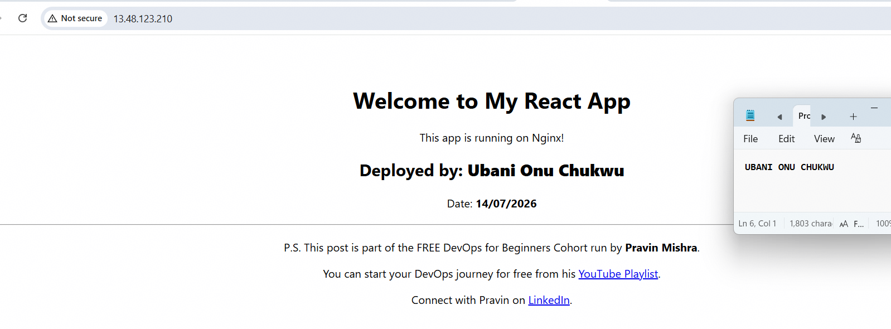

---

#### Screenshot 2 — Output of `ip a`

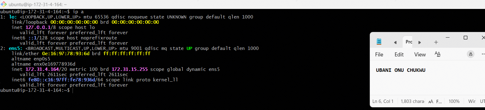

---

#### Screenshot 3 — Output of `sudo ss -tulpen`

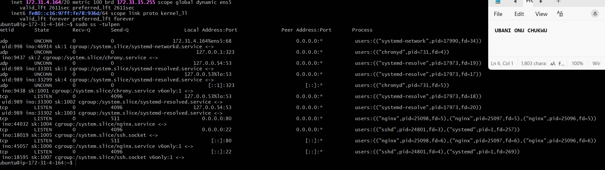

---

#### Screenshot 4 — Output of `sudo ufw status`

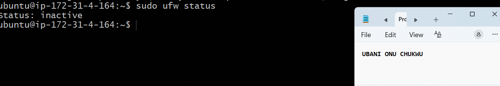

---

### Notes

**1. What proves Nginx is listening on 0.0.0.0:80?**

The `ss -tulpen` output shows a line with `LISTEN 0.0.0.0:80` tied to the `nginx` process (three worker PIDs). The `0.0.0.0` means it's bound to all available network interfaces, not just localhost, so it can accept connections from any external client — which is why the app is reachable via the public IP.

---

**2. What proves SSH is active on port 22?**

The output shows `LISTEN 0.0.0.0:22` and `[::]:22` tied to the `sshd` process. This confirms SSH is actively listening for incoming connections on both IPv4 and IPv6, which is how I'm able to remotely manage this server.

---

**3. Did you find any unexpected open ports? Explain briefly.**

No unexpected ports were found. Besides Nginx (80) and SSH (22), the only other listeners are `systemd-resolved` (DNS, bound to loopback/link-local only), `chronyd` (NTP time sync, port 323, loopback only), and `systemd-networkd` — all standard OS services that aren't exposed externally. `ufw` being inactive isn't a concern here since access control is enforced at the AWS Security Group level instead of the host firewall.

---

# Task 2 — Service Health & Systemd Validation (Nginx)

## Goal

Verify that Nginx is properly installed, running, enabled at boot, and safely configured.

### Evidence

#### Screenshot 1 — Output of `systemctl status nginx --no-pager`

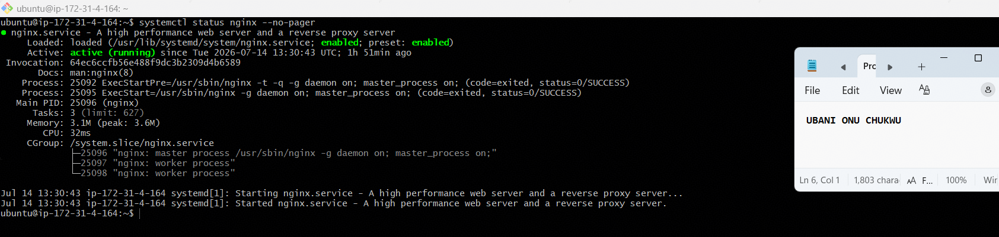

---

#### Screenshot 2 — Output of `sudo nginx -t`

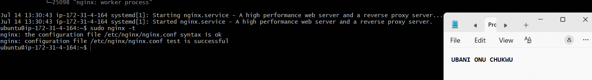

---

#### Screenshot 3 — Output of `sudo ss -lptn '( sport = :80 )'`

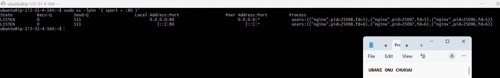

---

### Notes

**1. What happens if Nginx fails to restart in production?**

If Nginx fails to restart, the web server stops serving requests entirely, meaning the application becomes completely unreachable — users would see connection errors or timeouts. Since `systemctl` shows it's `enabled`, it will still attempt to start on boot, but a failed restart (e.g., due to a config error) means downtime until the issue is diagnosed and fixed. This is why `nginx -t` before any restart is critical — it catches syntax errors before they cause an outage.

---

**2. What's your basic rollback plan?**

Keep a backup of the last known-good config file (e.g., `sudo cp /etc/nginx/sites-available/default /etc/nginx/sites-available/default.bak`) before making changes. If a new config breaks the service, restore the backup with `sudo cp default.bak default`, run `sudo nginx -t` to confirm it's valid, then `sudo systemctl restart nginx`. For the application itself, keeping the previous `build/` folder (or pulling a known-good git commit) allows quickly re-deploying a working version to `/var/www/html/`.

---

# Task 3 — Logs & Request Trace

## Goal

Verify real traffic flow and analyze logs to understand system behavior and errors.

### Evidence

#### Screenshot 1 — Output of `sudo tail -n 30 /var/log/nginx/access.log`

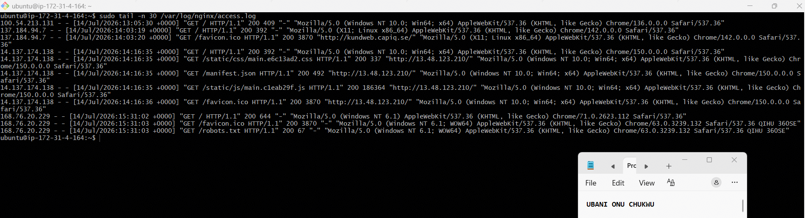

---

#### Screenshot 2 — Output of `sudo tail -n 30 /var/log/nginx/error.log`

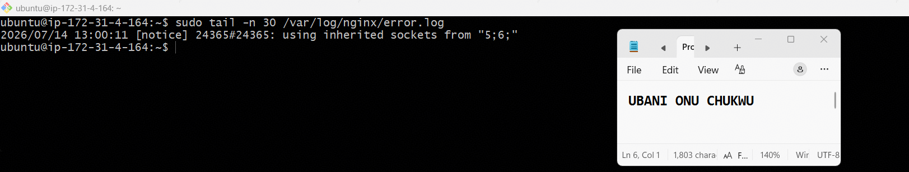

---

#### Screenshot 3 — Output of `sudo journalctl -u nginx --no-pager -n 50`

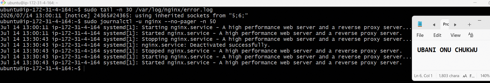

---

### Notes

**1. Were there any errors in the logs?**

No actual errors were found. The only entry in `error.log` was a `[notice]` level line — "using inherited sockets from '5;6;'" — which isn't an error, it's just Nginx logging that it inherited its listening sockets during a restart (a normal systemd behavior, not a failure).

---

**2. If there were no errors, what does that indicate about the system?**

An empty (or notice-only) error log over this period indicates the application and web server are stable — no crashes, no failed requests due to server misconfiguration, and no upstream/backend failures. It's a good sign of a healthy production system, though it doesn't rule out issues that haven't surfaced yet (e.g., rare edge cases or future load).

---

**3. Based on the access logs, were your curl requests visible in the log entries? What does that prove about traffic flow?**

Yes — my own browser requests (GET `/`, `/static/css/...`, `/static/js/...`, `/favicon.ico`, `/manifest.json`) are clearly visible with `200` status codes, timestamped to match when I tested the app in the browser. This proves the full traffic flow works end-to-end: request → Nginx → correct file served → response logged, confirming the deployment is genuinely serving live traffic and not just appearing to work.

---

# Task 4 — System Resource Health Check (Capacity Red Flags)

## Goal

Assess server capacity and detect potential performance or failure risks.

### Evidence

#### Screenshot 1 — Output of `uptime`

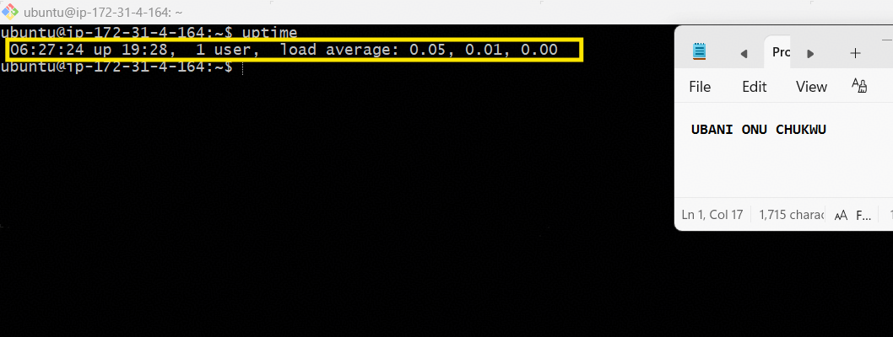

---

#### Screenshot 2 — Output of `free -h`

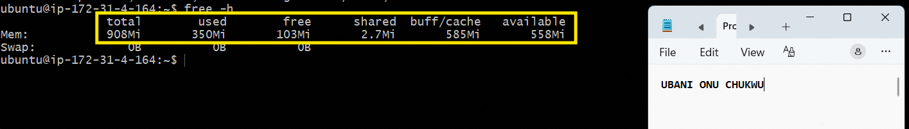

---

#### Screenshot 3 — Output of `df -h`

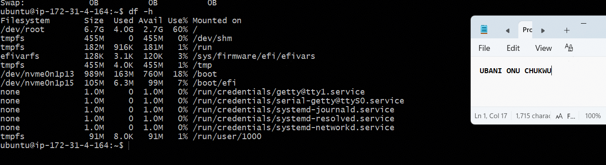

---

#### Screenshot 4 — Output of `sudo du -sh /var/* | sort -h`

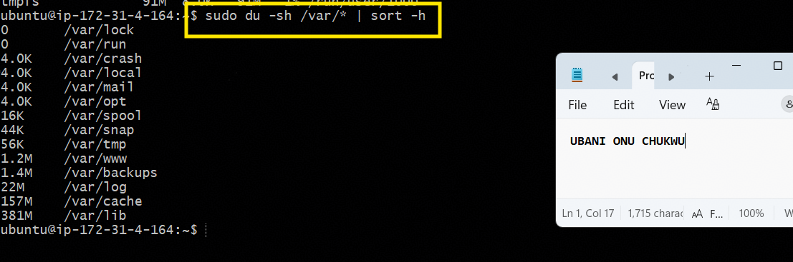

---

### Notes

**1. Which resource looks most critical right now? (CPU/load, memory, or disk) Explain why.**

Memory is the resource to watch most closely on this instance. Total RAM is only 908Mi (this is a t3.micro with limited memory), with 359Mi used and only 235Mi free (549Mi "available" once buff/cache is accounted for). While it's not critical yet, on a low-memory instance like this, running additional services or a heavier build process could push it toward exhaustion faster than CPU or disk would be a concern. CPU load average is a non-issue right now — `0.00, 0.00, 0.00` shows the server is essentially idle. Disk usage is at 59% (`/dev/root`), which is healthy with room to spare.

---

**2. What happens if disk becomes 100% full in a production server?**

If disk fills to 100%, the server can't write new files — this breaks logging (Nginx can't write access/error logs), can crash the application if it needs to write temp files or cache, and may even prevent the OS from completing basic operations like package updates or log rotation. In the worst case, a full disk can make a server effectively unresponsive or force a hard reboot to recover. This is why monitoring disk usage and setting up alerts (e.g., at 80-85% threshold) is standard production practice.

---

# Task 5 — Configuration & Deployment Verification

## Goal

Ensure the correct React build is deployed and Nginx is serving it properly.

### Evidence

#### Screenshot 1 — Output of `ls -lah /var/www/html | head -n 20`

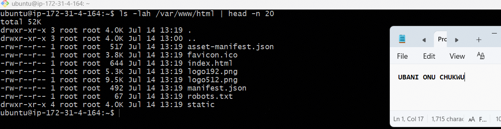

---

#### Screenshot 2 — Output of `grep -R "Deployed by" -n /var/www/html 2>/dev/null | head`

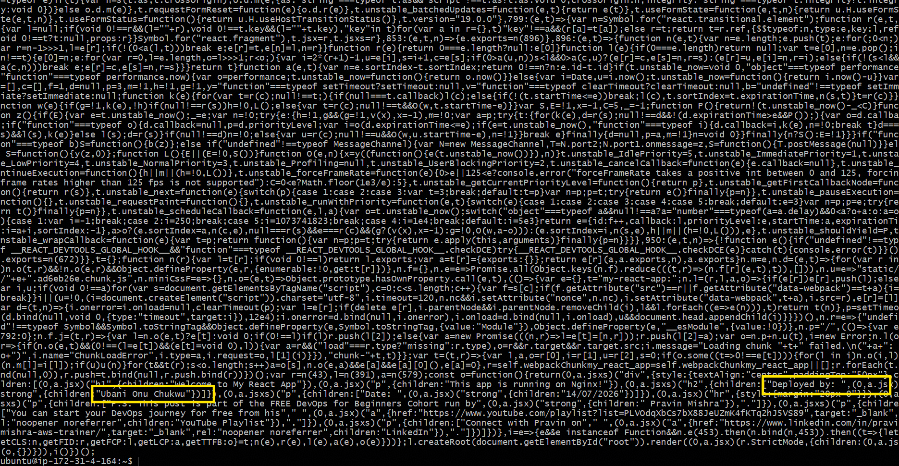

---

#### Screenshot 3 — Output of `grep -n "try_files" /etc/nginx/sites-available/default`

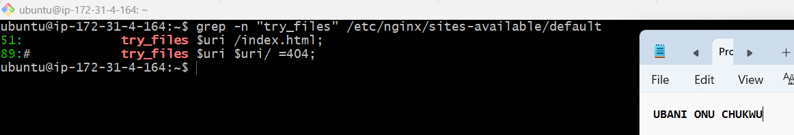

---

### Notes

**1. How do you confirm that the correct version of the application is deployed?**

I confirmed this two ways: first, by grepping the deployed files in `/var/www/html` for the personalized string "Deployed by" — it was found embedded in the minified `main.js` bundle, proving the exact build I created (with my name and date) is what's actually being served, not a stale or default version. Second, by checking the Nginx config's `try_files` directive to confirm it's set to `$uri /index.html` (React routing mode) rather than the default `$uri $uri/ =404`, which verifies the server is correctly configured to serve this specific type of single-page application.

---

# Task 6 — Nginx Configuration Failure Simulation

## Goal

Simulate a real-world Nginx misconfiguration and recover the service safely.

### Evidence

#### Screenshot 1 — Output of `sudo nginx -t` showing the syntax error (broken config)

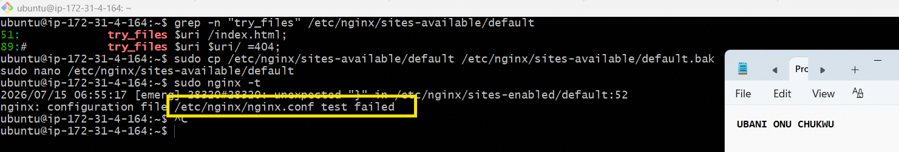

---

#### Screenshot 2 — Output of `sudo nginx -t` showing syntax ok (fixed config)

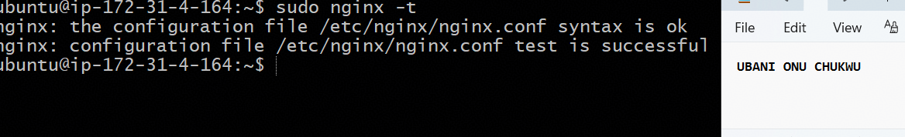

---

#### Screenshot 3 — Output of `curl -I http://<public-ip>` confirming recovery (200 OK)

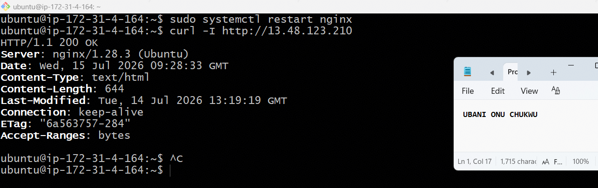

---

### Notes

**1. What caused the configuration failure?**

I intentionally removed the trailing semicolon from the `try_files $uri /index.html;` directive inside the `location /` block. Nginx's config syntax requires every directive to end with a semicolon — without it, the parser couldn't tell where that directive ended, so it misread the next line's closing brace `}` as part of the same statement, throwing an `unexpected "}"` error.

---

**2. How did you fix the issue?**

Since I'd taken a backup of the working config before making changes (`sudo cp default default.bak`), I simply restored it (`sudo cp default.bak default`), validated it with `sudo nginx -t` to confirm the syntax was clean, then restarted Nginx (`sudo systemctl restart nginx`) and verified recovery with a `curl -I` request returning `200 OK`.

---

**3. How can you avoid this kind of issue in real production systems?**

Always run `sudo nginx -t` before restarting or reloading Nginx after any config change — this validates syntax without affecting the running service, catching errors before they cause downtime. Additionally, keeping timestamped backups of working configs (or better, managing configs through version control/Git) makes rollback fast and reliable rather than having to manually rewrite the fix under pressure. In real production, config changes should also go through a staging environment or automated CI check before touching production.

---

# Task 7 — Web Application Failure Simulation

## Goal

Simulate missing deployment content and recover the application safely.

### Evidence

#### Screenshot 1 — Output of `curl -I http://<public-ip>` showing failure (non-200 response)

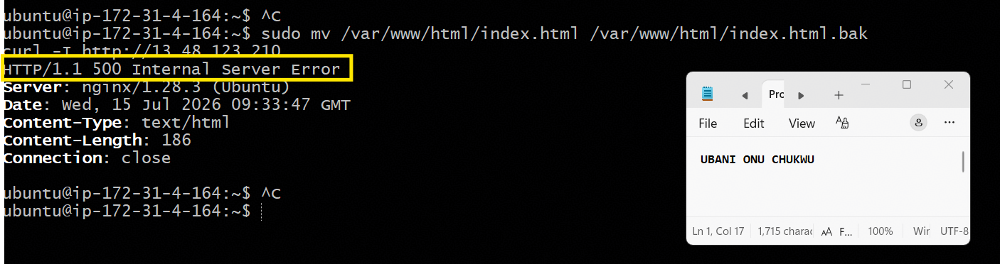

---

#### Screenshot 2 — Output of `curl -I http://<public-ip>` confirming recovery (200 OK)

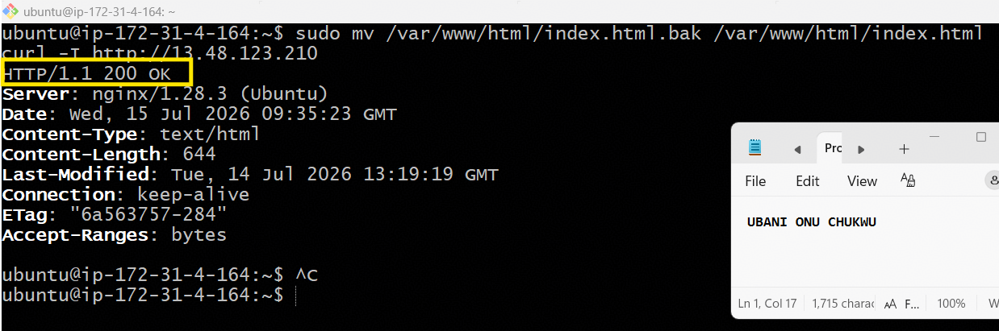

---

### Notes

**1. What caused the application to break in this scenario?**

I renamed/moved `index.html` out of `/var/www/html/`, simulating a scenario where a deployment accidentally omits or deletes the main entry file (e.g., a broken build script, an incomplete file copy, or a bad deployment). Since Nginx's `try_files $uri /index.html;` directive relies on `index.html` as its final fallback for React routing, removing that file left Nginx with no valid file to serve, resulting in a `500 Internal Server Error` rather than a simple 404.

---

**2. How did you fix the issue and restore the application?**

I moved the file back into place (`sudo mv /var/www/html/index.html.bak /var/www/html/index.html`) and confirmed recovery with `curl -I`, which returned `200 OK`. In a real incident, this would typically involve re-running the deployment step (copying the correct build output) rather than manually restoring a single file, but the underlying fix is the same: ensure the required static files exist in the web root.

---

**3. What steps would you take to prevent this kind of issue in real production systems?**

Automate deployments through a CI/CD pipeline that validates the build output (e.g., checks that `index.html` and `static/` exist) before deploying — this catches incomplete builds before they reach production. Additionally, implementing a health check (e.g., an automated `curl` or uptime monitor hitting the site every few minutes) would catch this kind of failure within minutes rather than relying on a user reporting it, and a proper rollback strategy (keeping the previous build available) allows quick recovery without needing to manually inspect and restore individual files.

---

# Task 8 — Security & Reliability Review

## Goal

Review and reflect on the security and reliability practices applied during this assignment.

### Security & Reliability Notes

**1. Why is SSH key-based authentication more secure than sharing passwords?**

SSH keys use asymmetric cryptography — a private key (kept secret on my machine) and a public key (placed on the server) — making them far harder to brute-force or guess than a password. Passwords can be weak, reused across services, or intercepted, while a private key is a much larger, unique secret that never needs to be transmitted over the network during authentication.

---

**2. Why should only required ports be open on a production server?**

Every open port is a potential entry point for attackers. Keeping only essential ports open (like 22 for SSH and 80/443 for web traffic) minimizes the attack surface — there's simply less for an attacker to probe, scan, or exploit. This is the same principle I applied in telecom network security: unused interfaces and services should always be locked down.

---

**3. Why is it important for Nginx to be enabled on boot?**

If the server reboots (due to a crash, maintenance, or AWS-side maintenance event) and Nginx isn't set to start automatically, the application would remain down until someone manually logs in and restarts the service — causing unnecessary downtime. `systemctl enable nginx` ensures the service self-heals after a reboot without manual intervention.

---

**4. What are the risks of sharing secrets, keys, or credentials publicly?**

Publicly exposed secrets (API keys, SSH private keys, passwords, tokens) can be found and exploited within minutes by automated bots scanning GitHub and other public repos — leading to unauthorized access, data breaches, resource hijacking (e.g., someone spinning up expensive cloud resources on your account), or complete system compromise. I experienced this firsthand earlier this cohort with a GitHub PAT exposure — it had to be revoked and replaced immediately once discovered.

---

**5. Why should cloud resources be stopped or terminated when they are no longer needed?**

Running cloud resources cost money by the hour/second regardless of whether they're actively used, so leaving them running unnecessarily leads to unexpected billing. It also increases the attack surface — an idle, forgotten server is still a live target for attackers, and it's less likely to be patched or monitored if no one remembers it's running.

---

# LinkedIn Post (Required)

## Evidence

#### LinkedIn Post URL

https://www.linkedin.com/posts/onuchukwu-ubani-10004741_devops-sitereliabilityengineering-linux-share-7483102394503995392-VJOE/?utm_source=share&utm_medium=member_desktop&rcm=ACoAAAi6A9ABP5zuoQ8QP1g4mp_mBXViSDgTxy0

---

#### Screenshot — Published LinkedIn post

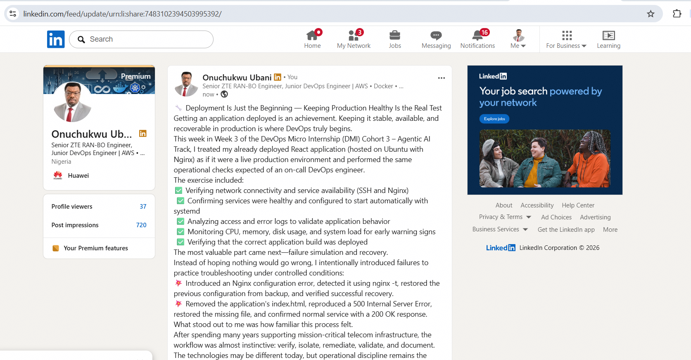

---

# Submission Instructions

- Add all required screenshots in your submission
- Full name must be visible in required screenshots
- Do not expose sensitive information (keys, passwords, account IDs)

---

# Completion Checklist

- [x] Task 1: Screenshots (browser, ip a, ss -tulpen, ufw status) + Notes answered
- [x] Task 2: Screenshots (nginx status, nginx -t, ss port 80) + Notes answered
- [x] Task 3: Screenshots (access log, error log, journalctl) + Notes answered
- [x] Task 4: Screenshots (uptime, free -h, df -h, du -sh) + Notes answered
- [x] Task 5: Screenshots (ls html, grep deployed by, grep try_files) + Notes answered
- [x] Task 6: Screenshots (nginx -t fail, nginx -t pass, curl recovery) + Notes answered
- [x] Task 7: Screenshots (curl failure, curl recovery) + Notes answered
- [x] Task 8: Security & Reliability Notes answered
- [x] LinkedIn post published and URL submitted
- [x] Full Name visible in all required screenshots
- [x] No sensitive data exposed

---

## 📌 About DMI & CloudAdvisory

DevOps Micro Internship (DMI) is a project-based DevOps program run by Pravin Mishra (The CloudAdvisory) focused on real-world execution, systems thinking, and career readiness.

It helps learners build strong DevOps foundations with hands-on experience.

---

## 📌 Resources

- 🌐 DMI Official Website: https://pravinmishra.com/dmi  
- 🎓 DevOps for Beginners (Udemy): https://www.udemy.com/course/devops-for-beginners-docker-k8s-cloud-cicd-4-projects/  
- 🎓 Agentic AI DevOps with Claude Code: https://www.udemy.com/course/ultimate-agentic-ai-devops-with-claude-code/  
- 🎓 DevOps with Claude Code: Terraform, EKS, ArgoCD & Helm: https://www.udemy.com/course/devops-with-claude-code-terraform-eks-argocd-helm/  
- ▶️ YouTube Playlist: https://www.youtube.com/playlist?list=PLFeSNDtI4Cho  
- 🔗 Pravin Mishra (LinkedIn): https://www.linkedin.com/in/pravin-mishra-aws-trainer/  
- 🏢 CloudAdvisory (LinkedIn): https://www.linkedin.com/company/thecloudadvisory/

---

*This submission is part of DevOps Micro Internship (DMI) Cohort 3 — Agentic AI Track.*