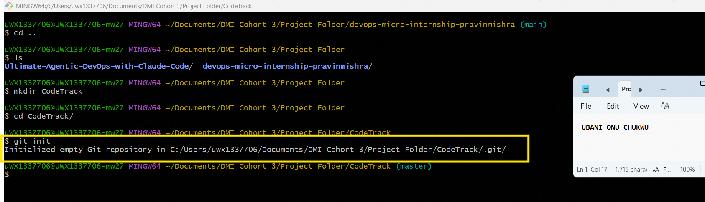
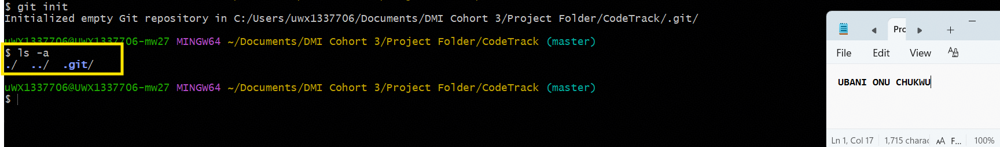
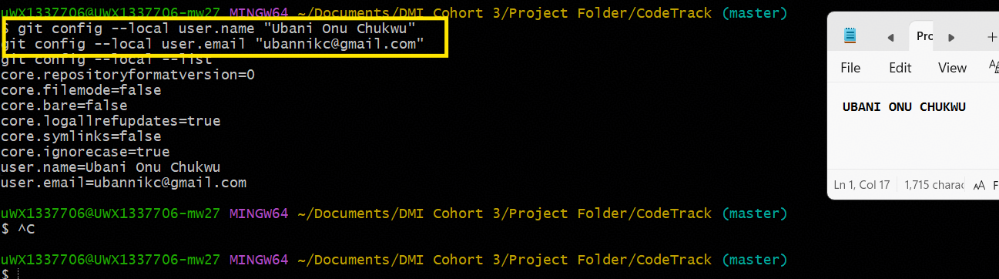
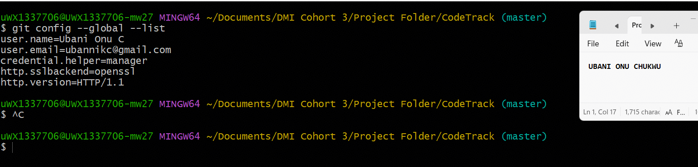

# Assignment 1 — CodeTrack: Initial Git Setup (Local Only)
Part of the DevOps Micro Internship (DMI) Cohort 3 with Agentic AI
---
## Purpose
In this assignment, you will set up Git correctly on your local machine before starting the CodeTrack project. You will create a local repository and configure your Git identity at both the repository level (local) and the machine level (global). This assignment is local only — you will not push anything to GitHub yet.
---
# Task 1 — Create the CodeTrack Project and Initialize Git
## Goal
Create a `CodeTrack` project folder and initialize it as a Git repository.
### Evidence
#### Screenshot 1 — Output of `git init` inside `CodeTrack` showing "Initialized empty Git repository"

---
#### Screenshot 2 — Output of `ls -a` showing the `.git` folder

---
### Notes
**1. What is the `.git` folder, and why does it matter?**

The `.git` folder is where Git stores everything it needs to track the project's version history — every commit, branch, tag, configuration setting, and the internal object database that holds snapshots of every tracked file version. It's created automatically by `git init` and is what actually turns a regular folder into a Git repository; without it, Git has no memory of changes, and deleting this folder would permanently erase the entire project history (while leaving the actual working files untouched). It matters because it's the single source of truth for version control — every `git commit`, `git log`, and `git diff` command reads from and writes to this folder.

---
# Task 2 — Configure Git Identity Locally (Repository-Only)
## Goal
Set your Git username and email for the `CodeTrack` repository only, using `git config --local`.
### Evidence
#### Screenshot 3 — Output of `git config --local --list` showing your `user.name` and `user.email`

---
# Task 3 — Configure Git Identity Globally
## Goal
Set a global Git username and email for this machine using `git config --global`. Note that CodeTrack's local settings still take priority over these.
### Evidence
#### Screenshot 4 — Output of `git config --global --list` showing your `user.name` and `user.email`

---
# Submission Instructions
- Add all required screenshots in your submission
- Full Name must be visible in required screenshots
- Do not expose passwords, access tokens, or private keys
---
# Completion Checklist
- [x] `CodeTrack` folder created and initialized as a Git repository (Screenshots 1–2)
- [x] Explanation of the `.git` folder written in your own words
- [x] Local `user.name` and `user.email` configured and verified (Screenshot 3)
- [x] Global `user.name` and `user.email` configured and verified (Screenshot 4)
- [x] No sensitive data exposed
---
## 📌 About DMI & CloudAdvisory
DevOps Micro Internship (DMI) is a project-based DevOps program run by Pravin Mishra (The CloudAdvisory) focused on real-world execution, systems thinking, and career readiness.
It helps learners build strong DevOps foundations with hands-on experience.
---
## 📌 Resources
- 🌐 DMI Official Website: https://pravinmishra.com/dmi
- 🎓 DevOps for Beginners (Udemy): https://www.udemy.com/course/devops-for-beginners-docker-k8s-cloud-cicd-4-projects/
- 🎓 Agentic AI DevOps with Claude Code: https://www.udemy.com/course/ultimate-agentic-ai-devops-with-claude-code/
- 🎓 DevOps with Claude Code: Terraform, EKS, ArgoCD & Helm: https://www.udemy.com/course/devops-with-claude-code-terraform-eks-argocd-helm/
- ▶️ YouTube Playlist: https://www.youtube.com/playlist?list=PLFeSNDtI4Cho
- 🔗 Pravin Mishra (LinkedIn): https://www.linkedin.com/in/pravin-mishra-aws-trainer/
- 🏢 CloudAdvisory (LinkedIn): https://www.linkedin.com/company/thecloudadvisory/
---
*This submission is part of DevOps Micro Internship (DMI) Cohort 3 — Agentic AI Track.*