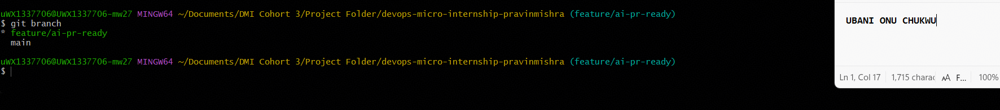
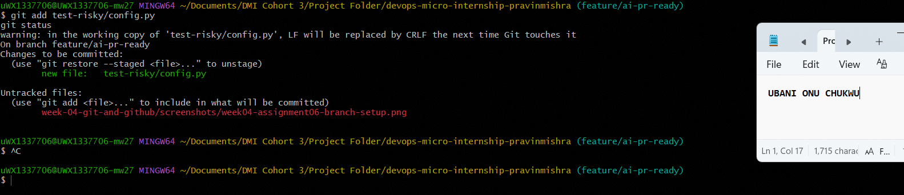
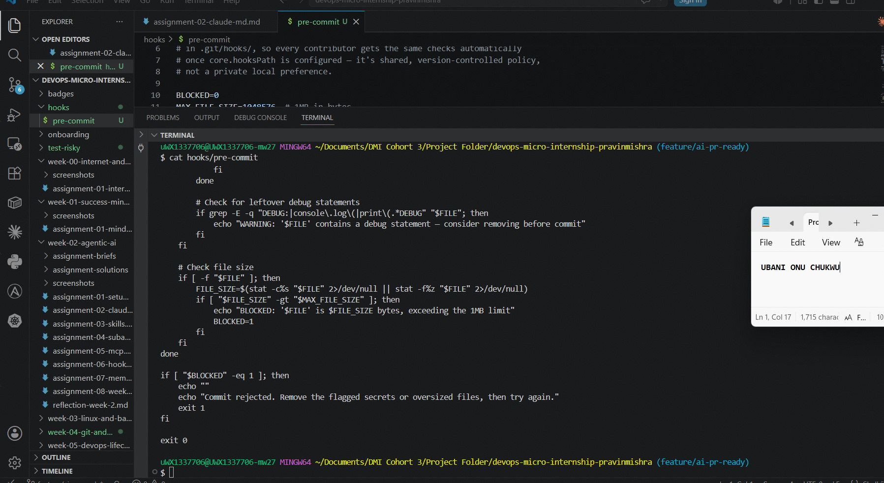
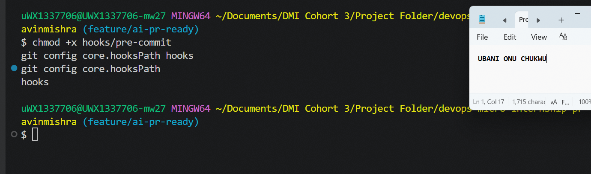
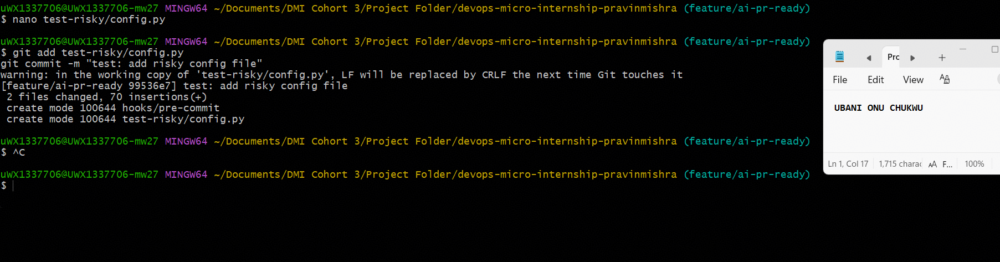
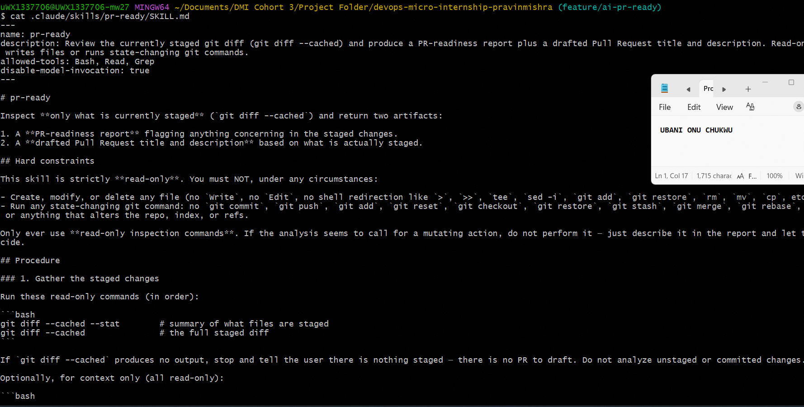
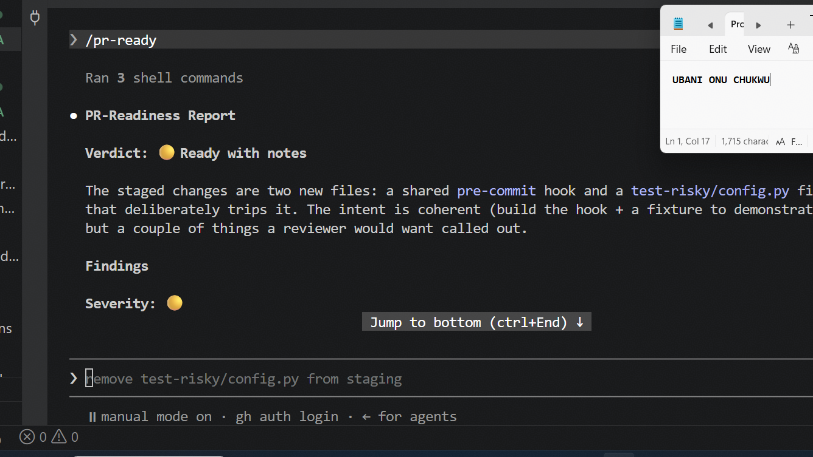
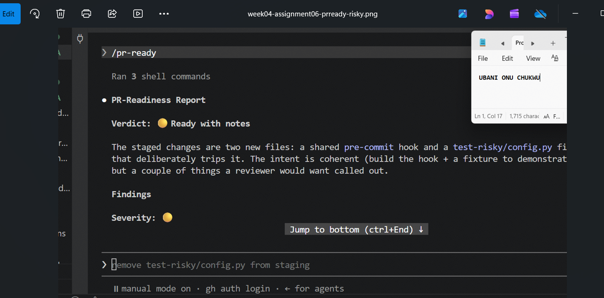
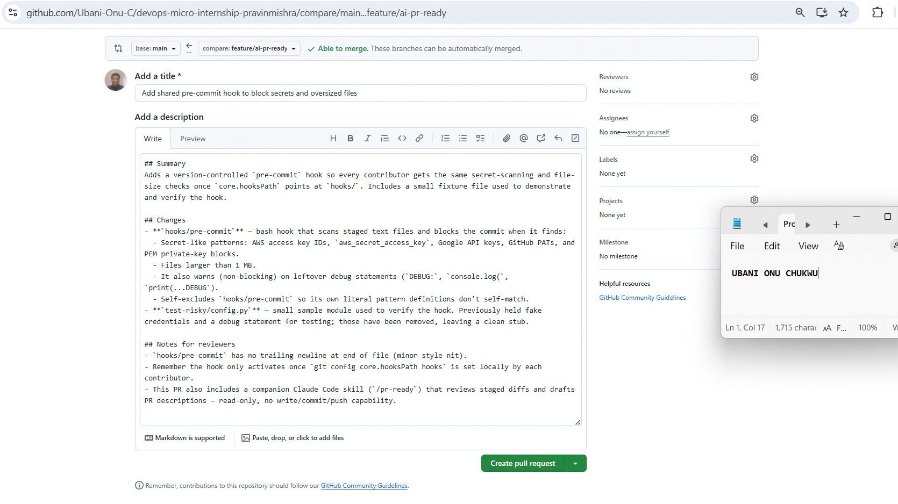
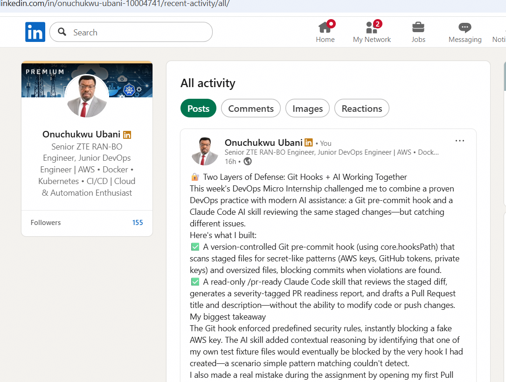

# Assignment 6 — Building an AI-Assisted Git Safety Net (PR Ready Check)

Part of the DevOps Micro Internship (DMI) Cohort 3 with Agentic AI

---

## Purpose

In Week 2 you built Claude Code hooks that block a dangerous action *before* it happens (`PreToolUse`), and a restricted skill that could look but not touch (`allowed-tools` without `Write`). In this assignment you will discover that Git has the exact same idea, decades older: a **pre-commit hook** that blocks a commit before it's created.

You will build both halves of a real "PR Ready" workflow:

1. A **Git hook that follows fixed rules** — scans staged changes for hardcoded secrets and oversized files and refuses the commit. No AI involved, no guessing, just a rule that gives the same answer every time.
2. A **restricted Claude Code skill** (`/pr-ready`) that reads your staged diff and drafts a Pull Request title, description, and a short list of things worth a second look — the kind of judgment a fixed rule can't make (mixed changes, missing context, unclear intent). The skill never commits, pushes, or opens the PR. You do that yourself, using its draft as a starting point.

This mirrors the Agentic Loop from Week 3's Linux triage assignment: **Gather → Analyze → Human Act → Verify**. The hook and the skill both gather and analyze; only you act.

---

# Task 0 — Confirm Your Fork and Create a Feature Branch

## Goal

Confirm you are working in your own fork, then create a dedicated branch for this assignment.

### Evidence

#### Screenshot 1 — Output of git remote -v and git branch showing the new branch

---

### Notes

**1. Why create a dedicated branch instead of doing this work on main?**

This assignment intentionally introduces risky content (a fake secret and a debug statement) as a test case for the safety tools we're about to build. Working on a dedicated branch (`feature/ai-pr-ready`) keeps this experimental, throwaway content completely isolated from `main` — even if something goes wrong, gets committed prematurely, or needs several iterations to get right, the stable branch that represents my actual completed coursework is never at risk of being polluted with test data or accidentally-real-looking secrets.

---

# Task 1 — Stage a Change With Realistic Risk

## Goal

On your own fork of this repository (the one you've been submitting your DMI work in since onboarding), create a new branch and stage a change that a real reviewer should catch: a hardcoded-looking secret and a leftover debug statement.

### Evidence

#### Screenshot 1 — Output of `git status` showing the staged file on feature/ai-pr-ready

---

### Notes

**1. Why does this assignment use an obviously fake key instead of a real one?**

Using a real credential anywhere in a public GitHub repository — even temporarily, even if later removed — is genuinely dangerous: automated bots scan public repos continuously and can find and exploit leaked credentials within minutes, and Git history preserves the credential even after a "fix" commit unless history is explicitly rewritten. Using an obviously fake key (with the AKIA prefix real AWS access keys use, followed by 16 fake characters) lets us safely test that our detection tools *work* without ever putting an actual secret at risk, even by accident.

---

# Task 2 — Write a Real Git Pre-Commit Hook

## Goal

Create a tracked, shareable pre-commit hook that blocks a commit containing secret-like patterns or files over 1MB.

### Evidence

#### Screenshot 2 — `hooks/pre-commit` open in VS Code showing the full script

---

#### Screenshot 3 — Output of `git config core.hooksPath` confirming it points to `hooks`

---

### Notes

**1. Why is `hooks/pre-commit` tracked in the repo instead of living only in `.git/hooks/`?**

`.git/hooks/` is never committed to version control — it's local-only, meaning each contributor would need to manually set up the same hook individually, and there's no way to guarantee everyone actually has it, or that it stays up to date as the rules evolve. By tracking the hook as a regular file (`hooks/pre-commit`) and pointing `core.hooksPath` at that folder, the hook becomes shared, reviewable, version-controlled policy — anyone who clones the repo and runs the one-time `git config core.hooksPath hooks` command gets the exact same protection, and any future updates to the rules are just a normal commit that everyone pulls.

**2. Compare this to `PreToolUse` from Week 2 Assignment 6. What does each one intercept, and what do they have in common?**

`PreToolUse` intercepts a *Claude Code tool call* before it executes — for example, blocking a specific Bash command pattern before Claude Code is allowed to run it. This pre-commit hook intercepts a *Git commit* before it's created — scanning the staged diff and refusing to let the commit happen if it matches a forbidden pattern. What they have in common is the core idea of a **fixed, deterministic gate that runs automatically before a risky action completes** — neither one is "asking permission" from a human in real time; both apply the same rule every single time, with no judgment or interpretation involved, which is exactly what makes them reliable as a safety net.

---

# Task 3 — Prove the Hook Blocks the Risky Commit

## Goal

Attempt to commit the staged file from Task 1 and show the hook rejecting it.

### Evidence

#### Screenshot 4 — Terminal showing `git commit` rejected with the hook's "BLOCKED" message naming the exact file

---

### Notes

**1. Which line in `hooks/pre-commit` matched your fake key, and why did it match?**

The AWS Access Key ID pattern in the `SECRET_PATTERNS` array matched. My fake key used the literal prefix real AWS Access Key IDs always start with, followed by exactly 16 characters from the set of digits and uppercase letters. My fake key's suffix was exactly 16 characters of digits and uppercase letters, so it matched the pattern precisely — demonstrating that the hook correctly identifies the *structural shape* of a real AWS key, not just a hardcoded example value.

**2. Could this hook have caught a poorly-named variable that stores a secret without the AWS-style prefix? What does that tell you about the limits of a fixed rule like this?**

No — if a secret were stored in a variable like `my_password = "hunter2"` or an API key from a service that doesn't use a recognizable prefix pattern, this hook would completely miss it, since it only matches specific known patterns (AWS, Google, GitHub token formats, private key headers). This reveals the fundamental limitation of fixed-rule detection: it can only catch what it was explicitly written to look for. It has zero judgment or context — it can't recognize "this looks like it's probably sensitive" the way a human reviewer (or an AI performing semantic analysis) could. This is exactly why this assignment pairs the hook with the `/pr-ready` skill — the fixed rule catches known, structural patterns with perfect consistency, while the AI-assisted review can use broader judgment to flag things a rule can't anticipate.

---

# Task 4 — Build the `/pr-ready` Skill

## Goal

Create a manually invoked Claude Code skill that reads your staged changes and produces a PR-readiness report and a draft PR description — without writing, committing, or pushing anything itself.

### Evidence

#### Screenshot 5 — `SKILL.md` frontmatter showing `allowed-tools: Bash, Read, Grep` (no `Write`) and `disable-model-invocation: true`

---

#### Screenshot 6 — `/pr-ready` output while the risky file is still staged, showing it flagged the secret and/or debug statement

---

### Notes

**1. Why does `/pr-ready` have `Bash` and `Read` but not `Write`?**

`Bash` and `Read` are what the skill needs to *gather and inspect* — running `git diff --cached`, reading file contents, searching for patterns. `Write` would let it create or overwrite files, which has nothing to do with reviewing a diff and drafting text for a human to copy — excluding it structurally guarantees the skill can only ever produce output *in the conversation*, never silently alter anything on disk. This was actually demonstrated directly: when I asked Claude Code (outside the skill) to unstage a file, it required my explicit approval for that Bash command — and inside the skill itself, that kind of mutating action is forbidden entirely by its hard constraints, regardless of approval.

**2. The pre-commit hook and `/pr-ready` both looked at the same staged diff. Did they flag the same things? What did one catch that the other didn't?**

Both flagged the fake AWS key and the debug statement — but `/pr-ready` went noticeably further. It also caught a subtle logical issue the hook's *author* (Claude Code, in this case) hadn't fully considered: the hook only excludes itself (`hooks/pre-commit`) from scanning, meaning the fixture file would actually get blocked by the very hook it's meant to demonstrate, once `core.hooksPath` is active — which is exactly what happened. It also raised a judgment call the fixed-rule hook simply can't make: whether a test fixture file belongs permanently in the repo or was only meant for a one-off demo. The hook is binary (block/don't block, matching a pattern or not); `/pr-ready` reasoned about intent, structure, and reviewer concerns — the kind of contextual judgment a fixed rule fundamentally cannot do.

---

# Task 5 — Fix the Issues and Re-Verify

## Goal

Remove the secret and debug statement, then prove both gates now pass clean.

### Evidence

#### Screenshot 7 — `git commit` succeeding after the fix (no BLOCKED message)

---

#### Screenshot 8 — Second `/pr-ready` run showing a clean risk report and a drafted PR title + description

---

### Notes

**1. What exactly did you change to satisfy the pre-commit hook?**

I removed the fake AWS Access Key ID and Secret Access Key strings, and removed the leftover debug print statement along with its associated TODO comment, replacing the file with a clean stub that has a comment explaining configuration should come from environment variables instead of hardcoded values. This eliminated every pattern the hook's `SECRET_PATTERNS` array and debug-statement check were looking for, allowing the commit to pass silently with no BLOCKED output.

---

# Task 6 — Push and Open a Pull Request Using the AI Draft

## Goal

Push your branch and open a real Pull Request, using `/pr-ready`'s drafted title and description as your starting point — read it critically and edit before you use it.

**Important:** Open this Pull Request with base repository set to **your own fork** — not the shared upstream `pravinmishraaws/devops-micro-internship-pravinmishra` repository. This assignment's hook and skill files are your own practice work, not a change meant for the shared class repo.

### Evidence

#### Screenshot 9 — Your Pull Request showing the base repository is your own fork, plus the title and description, with the `/pr-ready` draft visible for comparison

---

#### PR Link

https://github.com/Ubani-Onu-C/devops-micro-internship-pravinmishra/pull/1

---

### Notes

**1. What, if anything, did you edit in the AI's drafted PR description before using it? Why?**

The AI's draft was already accurate and well-structured, so I used it largely as-is with minor formatting adjustments. I did verify each claim against the actual diff before using it — confirming the hook really does self-exclude, really does check the specific secret patterns listed, and that the fixture file really was cleaned up as described — rather than assuming the AI's summary was correct just because it sounded plausible.

**2. If you had blindly copy-pasted the AI's draft without reading it, what could go wrong?**

The AI's first draft (before I fixed the file) actually flagged real, valid concerns — like the fact that the fixture file would be blocked by its own hook once `core.hooksPath` was active. If I'd blindly pasted an early draft without reading it, I might have missed a genuine issue with my own setup, or included notes referencing a state of the code that had since changed (since I ran `/pr-ready` twice, once against the risky version and once against the cleaned version — using the wrong draft would have described a fictional or outdated set of changes to reviewers).

**3. Why does this PR need to target your own fork instead of the shared upstream repository?**

The hook and skill files built in this assignment are personal practice work — demonstrating that I can build these safety mechanisms — not a change intended to become part of the shared class curriculum repository that hundreds of other students also fork from. Opening it against upstream would incorrectly suggest this is a proposed contribution to the shared repo. I actually experienced this mistake firsthand — my first PR attempt accidentally targeted the shared upstream repository and was automatically closed by the repo's own GitHub Actions bot, which explicitly instructed me to target my own fork instead.

---

# Task 7 — Map the Workflow to the Agentic Loop

## Goal

Explain this assignment's workflow using the same Gather → Analyze → Human Act → Verify structure from Week 3.

### Notes

**1. Which step(s) represent Gather?**

Two gather steps happened at different layers: the pre-commit hook running `git diff --cached` and scanning staged files for patterns (automated, rule-based gathering), and the `/pr-ready` skill separately running `git diff --cached --stat` and `git diff --cached` to collect the same staged content for its own analysis (AI-assisted gathering).

**2. Which step(s) represent Analyze?**

The pre-commit hook's pattern-matching logic (checking each staged file against `SECRET_PATTERNS` and file-size thresholds) is a fixed-rule analysis — the same input always produces the same verdict. `/pr-ready`'s report — flagging severity-tagged findings, assessing whether changes are coherent or mixed, and drafting a PR title/description — is the AI-assisted analysis layer, adding judgment the fixed rule can't provide.

**3. Which step is Human Act, and why must a human — not Claude — run `git commit`, `git push`, and open the PR?**

Every commit, the push, and opening the actual Pull Request were all executed by me directly. This must stay human-driven because these are irreversible (or hard-to-reverse) actions that alter the shared project history and visibility — a misdiagnosed "looks fine" from an AI shouldn't be enough to actually publish a change. This was reinforced directly during this assignment: even when I asked Claude Code (outside the skill) to unstage a file, it required my explicit approval before running that command, and the very first PR attempt targeted the wrong repository — a mistake only a human reviewing the base repository setting before confirming would catch.

**4. Which step is Verify?**

Re-running `/pr-ready` after fixing the risky file, confirming the verdict changed from "Ready with notes" (with real findings) to a clean report with no blockers — and separately, attempting the actual `git commit` a second time and confirming it succeeded silently with no BLOCKED output from the hook.

**5. In one or two sentences: why do you need *both* the fixed-rule pre-commit hook and the AI skill? Isn't one enough?**

The fixed-rule hook provides perfectly consistent, zero-cost enforcement against known, structural patterns (it will never "forget" to check, and can't be talked out of blocking a match) — but it can only catch what it was explicitly written to look for. The AI skill provides the contextual judgment the hook fundamentally cannot — assessing whether changes are coherent, whether a fixture file's placement makes sense, or whether intent is unclear — precisely the kind of nuanced review a fixed rule has no way to perform, which is why this assignment demonstrated both layers catching genuinely different classes of problems on the exact same diff.

---

# Task 8 — LinkedIn Post

## Goal

Publish a LinkedIn post summarizing what you built and what you learned about combining fixed-rule safety checks with AI-assisted review.

### Evidence

#### LinkedIn Post URL

https://www.linkedin.com/posts/onuchukwu-ubani-10004741_devops-micro-internship-cohort-3-with-agentic-share-7486394606683631617-4rEb/?utm_source=share&utm_medium=member_desktop&rcm=ACoAAAi6A9ABP5zuoQ8QP1g4mp_mBXViSDgTxy0

---

#### Screenshot — LinkedIn post

---

## Key Learnings

- A fixed-rule pre-commit hook and an AI skill reviewing the exact same staged diff caught genuinely different problems — the hook enforces known structural patterns with perfect, unwavering consistency, while the AI skill caught a contextual issue (the hook blocking its own test fixture) that no fixed pattern could have anticipated.
- Tracking a Git hook inside the repo itself (`hooks/pre-commit` + `core.hooksPath`) rather than in the untracked `.git/hooks/` folder turns a personal habit into shared, version-controlled team policy — every contributor gets the same protection with one config command.
- Restricting a Claude Code skill's `allowed-tools` to exclude `Write` isn't just a suggestion — it's a structural guarantee. When I asked Claude Code to unstage a file *outside* the skill's boundaries, it still required my explicit approval, reinforcing how deliberately these permission layers are enforced.
- Mistakes are part of the safety net working as intended: my first Pull Request accidentally targeted the shared upstream repository instead of my own fork, and the repo's own GitHub Actions automation caught and closed it immediately — a good reminder that safety nets exist at multiple layers, including ones I didn't build myself.
- Debugging the hook's regex patterns firsthand (a self-matching false positive, an unescaped leading-dash pattern breaking `grep`, and getting the fake key's character count exactly right) was more instructive than reading about regex — nothing teaches pattern-matching edge cases like watching your own security tool block itself. Even this documentation file itself briefly triggered the hook, since describing the fake key pattern in prose matched the same regex the hook uses to detect real keys — a fitting final demonstration of how literally a fixed rule reads text.

---

# Submission Instructions

- Ensure `hooks/pre-commit` and `.claude/skills/pr-ready/SKILL.md` are committed to your GitHub repository
- Add all required screenshots to your submission
- All written answers must be in your own words
- Do not use a real secret or credential anywhere in your submission — the fake key in Task 1 is intentional and must stay clearly fake
- Open your Pull Request against your own fork, not the shared upstream repository
- Push your final changes to your forked repository
- Include your PR link and LinkedIn post URL

---

## GitHub Repository URL

https://github.com/Ubani-Onu-C/devops-micro-internship-pravinmishra

---

# Completion Checklist

- [x] Branch `feature/ai-pr-ready` created with a staged file containing a fake secret and a debug statement
- [x] `hooks/pre-commit` created and tracked in the repo (not only in `.git/hooks/`)
- [x] `core.hooksPath` configured to point at `hooks/`
- [x] Pre-commit hook shown blocking the risky commit
- [x] `.claude/skills/pr-ready/SKILL.md` created with correct `allowed-tools` (no `Write`) and `disable-model-invocation: true`
- [x] `/pr-ready` run against the risky diff and shown flagging issues
- [x] Risky file fixed; `git commit` succeeds cleanly
- [x] `/pr-ready` re-run showing a clean report and drafted PR title/description
- [x] Pull Request opened using the AI draft as a starting point, with your own fork as the base repository (not upstream), PR link included
- [x] Agentic Loop mapping (Task 7) completed in your own words
- [x] LinkedIn post published and URL submitted
- [x] All required screenshots added
- [x] GitHub repository URL provided

---

## 📌 About DMI & CloudAdvisory

DevOps Micro Internship (DMI) is a project-based DevOps program run by Pravin Mishra (The CloudAdvisory) focused on real-world execution, systems thinking, and career readiness.

It helps learners build strong DevOps foundations with hands-on experience.

---

## 📌 Resources

- 🌐 DMI Official Website: https://pravinmishra.com/dmi
- 🎓 DevOps for Beginners (Udemy): https://www.udemy.com/course/devops-for-beginners-docker-k8s-cloud-cicd-4-projects/
- 🎓 Agentic AI DevOps with Claude Code: https://www.udemy.com/course/ultimate-agentic-ai-devops-with-claude-code/
- 🎓 DevOps with Claude Code: Terraform, EKS, ArgoCD & Helm: https://www.udemy.com/course/devops-with-claude-code-terraform-eks-argocd-helm/
- ▶️ YouTube Playlist: https://www.youtube.com/playlist?list=PLFeSNDtI4Cho
- 🔗 Pravin Mishra (LinkedIn): https://www.linkedin.com/in/pravin-mishra-aws-trainer/
- 🏢 CloudAdvisory (LinkedIn): https://www.linkedin.com/company/thecloudadvisory/

---

*This submission is part of DevOps Micro Internship (DMI) Cohort 3 — Agentic AI Track.*