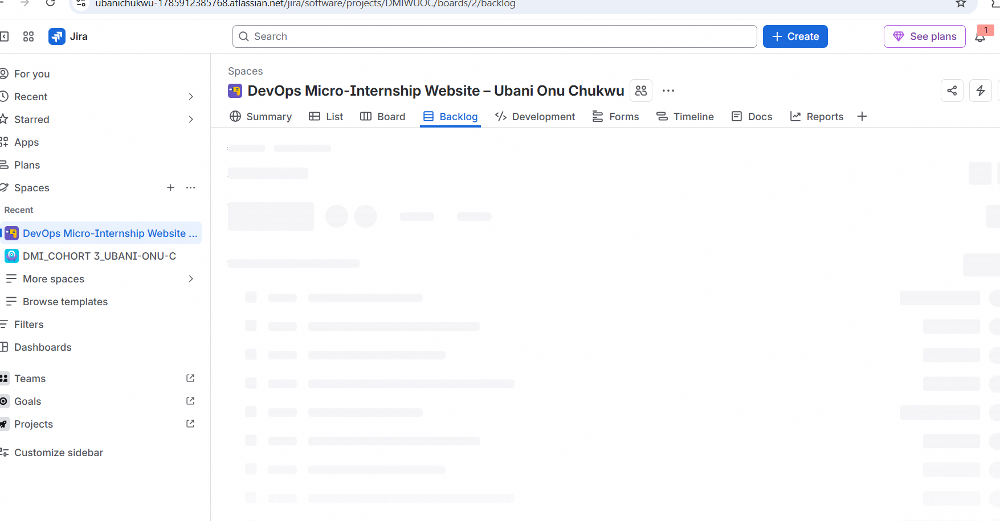
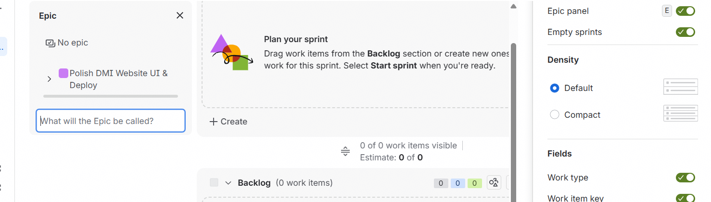
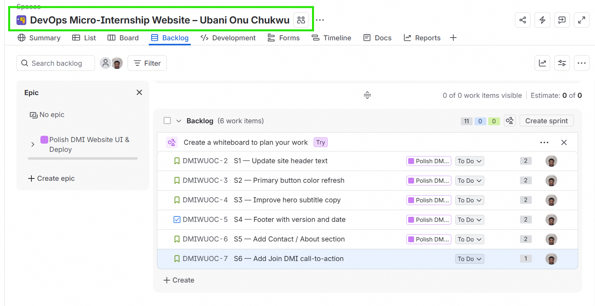
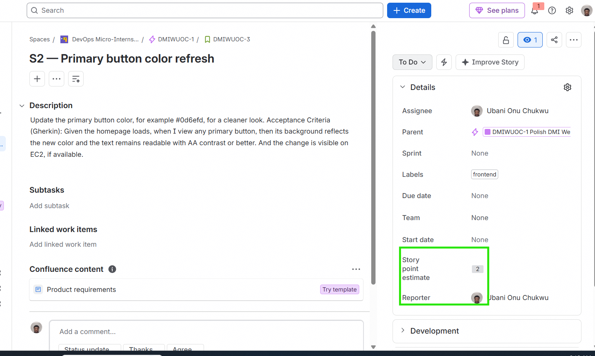

# Assignment 2 — Stand Up Scrum in Jira for the DevOps Micro-Internship Website

Part of the DevOps Micro Internship (DMI) Cohort 3 with Agentic AI

---

## Purpose

In this assignment, you will configure a private, team-managed Scrum Space in Jira Cloud for a DevOps Micro-Internship Website improvement and deployment initiative. You will build the complete work hierarchy and delivery workflow: Space → Epic → Stories → Sub-tasks → Labels → Sprint → Filters → Reports.

---

# Task 1 — Create the Jira Space (Team-Managed Scrum)

## Goal

Create a private, team-managed Scrum Space named `DevOps Micro-Internship Website – <YourName>`.

### Evidence

#### Screenshot 1 — Space confirmation or Space sidebar showing the Space name and key

---

# Task 2 — Create Your First Epic from the Backlog

## Goal

Create the Epic `Polish DMI Website UI & Deploy` to group the website UI and deployment work.

### Evidence

#### Screenshot 2 — Backlog showing the Epic panel enabled and the Epic visible

---

# Task 3 — Seed the Product Backlog with Six Stories

## Goal

Create all six required Stories (S1–S6) under the Epic, assign every Story to yourself, and add the required description, Fibonacci story point estimate, and label. Enter the Gherkin acceptance criteria directly below the Story description in the same description box.

### Evidence

#### Screenshot 3 — Backlog showing the Epic and all six Stories under it

---

#### Screenshot 4 — One opened Story showing its Story point estimate, acceptance criteria, and label

---

### Stories Created

**S1 — Update site header text (2 pts, label: frontend)**
Change the top header to: "DevOps Micro-Internship — Learn by Building"
Acceptance Criteria: Given I open the homepage, when the page loads, then the header shows exactly "DevOps Micro-Internship — Learn by Building". And the change is visible on the EC2 URL, if available.

**S2 — Primary button color refresh (2 pts, label: frontend)**
Update the primary button color, for example #0d6efd, for a cleaner look.
Acceptance Criteria: Given the homepage loads,