# Assignment 4 — Gotto Job: Backlog Refinement & Sprint 1 in Jira

Part of the DevOps Micro Internship (DMI) Cohort 3 with Agentic AI

---

## Purpose

In this 90-minute, time-boxed exercise, you will act as a Scrum team — or run in Solo Mode, playing every role yourself — to turn the Gotto Job template into a value-ordered backlog, estimate the work in story points, plan Sprint 1, open the burndown chart, and ship one small UI-only increment (text, color, spacing, a label, or a CTA — no backend changes).

---

# Task 1 — Roles & Mode Setup (Team vs Solo)

## Goal

Choose Team Mode or Solo Mode, and document how each Scrum role (Product Owner, Scrum Master, Dev Lead, DevOps Lead) was handled.

### Evidence

#### Screenshot 1 — Jira "Create project" screen, or the project sidebar after creation

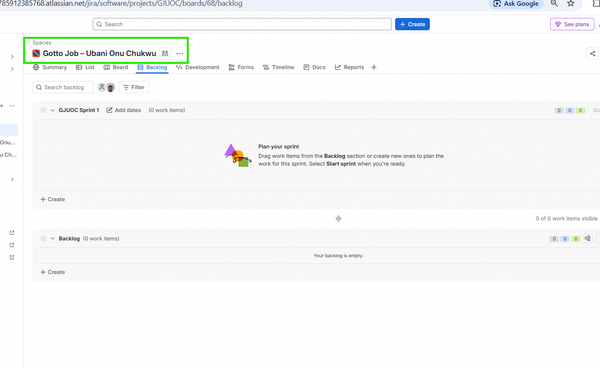

---

### Notes

**Working Mode:** Solo Mode — I performed every step and played all four Scrum roles myself.

**PO (Product Owner):** I prioritized UI improvements that most directly affect trust and clarity for job seekers — hero tagline clarity and the "Apply Now" CTA were ranked highest since they most directly impact whether a visitor understands the site and takes action.

**SM (Scrum Master):** I ensured process by following the sequence deliberately — refining the backlog before estimating, estimating before sprint planning, and not moving into implementation until Sprint 1 scope and goal were explicitly defined.

**Dev Lead:** I implemented the UI-only change directly in the Gotto Job template's HTML, keeping the change scoped to a single visual concern (no backend logic touched).

**DevOps Lead:** I shipped the change via Git commit and manual deployment to the public EC2 instance on a dedicated port, verifying the live URL after deployment — the same commit → deploy → verify loop used throughout this cohort.

---

# Task 2 — Create the Jira Project (Team-managed → Scrum)

## Goal

Create a Team-managed Scrum project named `Gotto Job – Team <#>` (Team Mode) or `Gotto Job – <YourName>` (Solo Mode).

### Evidence

#### Screenshot 2 — Project created page showing the project name and key

---

# Task 3 — Create the Epic

## Goal

Create the Epic `Improve Gotto Job UI discoverability & trust` to group the UI improvement initiative.

### Evidence

#### Screenshot 3 — Backlog showing the Epic panel with the Epic visible

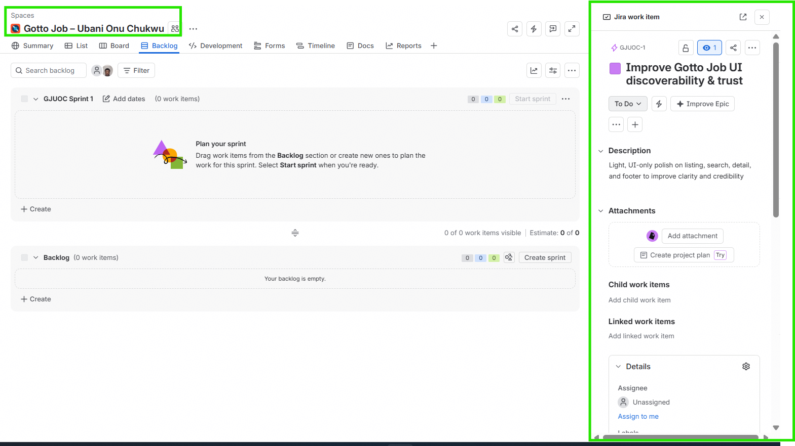

---

# Task 4 — Seed the Product Backlog (6–8 Stories + Fibonacci Points + Ranking)

## Goal

Create at least six Stories under the Epic, estimate each with 1, 2, or 3 story points, and rank them by value.

### Evidence

#### Screenshot 4 — Backlog showing the Epic and at least six Stories under it

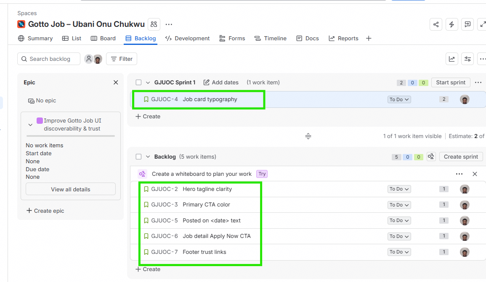

---

#### Screenshot 5 — One Story opened showing its Story Points and acceptance criteria filled in

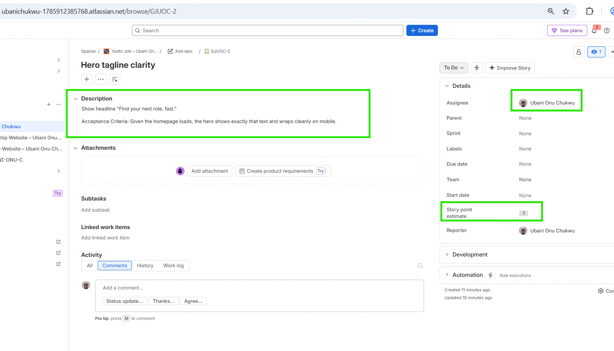

---

### Stories Created (ranked by value, highest first)

1. **Hero tagline clarity (1 pt)** — Show headline "Find your next role, fast." Given the homepage loads, the hero shows exactly that text and wraps cleanly on mobile.
2. **Job detail Apply Now CTA (1 pt)** — Add a prominent "Apply Now" button linking to mailto: or #. The button is above the fold, keyboard-focusable, and clickable.
3. **Primary CTA color (1 pt)** — Change the primary menu/button to a high-contrast color (e.g. #198754). Background updated site-wide; hover state distinct; text remains readable.
4. **Job card typography (2 pts)** — Make job titles larger and bolder. On the Job Listing page, titles are visually dominant.
5. **Posted on <date> text (1 pt)** — Add a human-readable posted date to cards. Each card shows "Posted on <DD Mon YYYY>".
6. **Footer trust links (1 pt)** — Add "About" and "Contact" links. Links visible, keyboard-focusable, and route correctly.

---

# Task 5 — Planning Poker (Estimate + Debate Notes)

## Goal

Confirm the Story Points (1, 2, or 3) for each Story and record brief reasoning for each estimate.

### Evidence

#### Screenshot 6 — Backlog showing Story Points visible

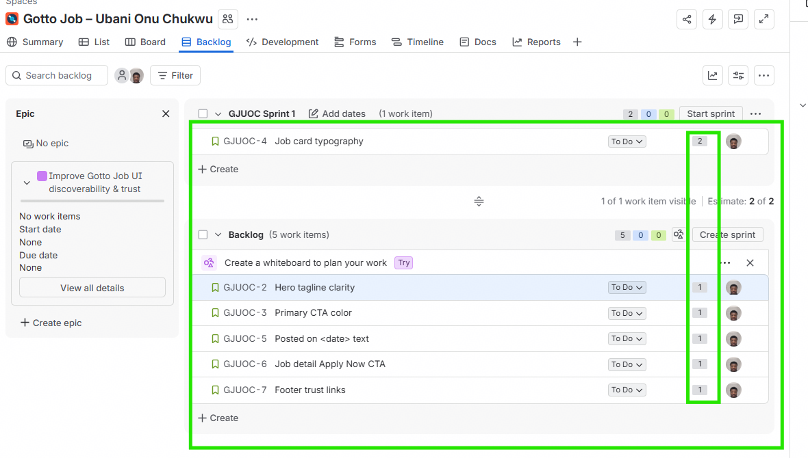

---

### Notes

**Hero tagline clarity — 1 pt:** Pure text change, single location, no layout risk. Straightforward.

**Primary CTA color — 1 pt:** A CSS color value change applied via existing variables/classes — low complexity, though it touches multiple locations (any button using the primary class).

**Job card typography — 2 pts:** Requires touching CSS that affects a repeated component (job cards), and needs visual verification across multiple card instances to confirm consistency — slightly more involved than a single-location text/color change.

**Posted on date text — 1 pt:** Static text addition to an existing card template. Simple, low-risk.

**Job detail Apply Now CTA — 1 pt:** Adding one button with a link — small, isolated addition.

**Footer trust links — 1 pt:** Adding two links to an existing footer structure — trivial addition.

In Solo Mode, no live estimation debate occurred, but "Job card typography" was the only Story I initially considered as 1 point before reconsidering — since it touches a repeated component across the whole listing page rather than a single element, I settled on 2 points to reflect the slightly broader verification surface.

---

# Task 6 — Sprint Planning: Create Sprint 1 + Sprint Goal + Scope

## Goal

Create Sprint 1, move three or four Stories into it (approximately 3–6 points), set the Sprint Goal, and break each selected Story into Build, Verify, Deploy, and Screenshot Sub-tasks.

### Evidence

#### Screenshot 7 — Sprint 1 with the selected Stories inside it

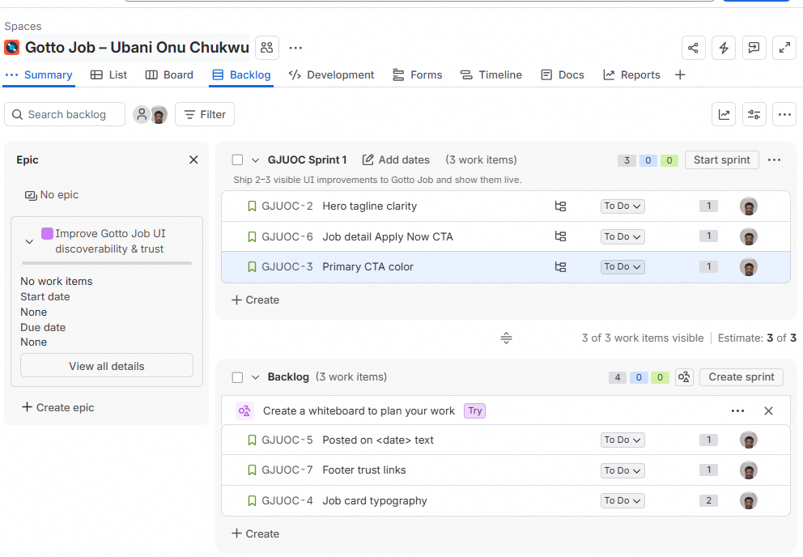

---

#### Screenshot 8 — One Story showing the Sub-tasks created

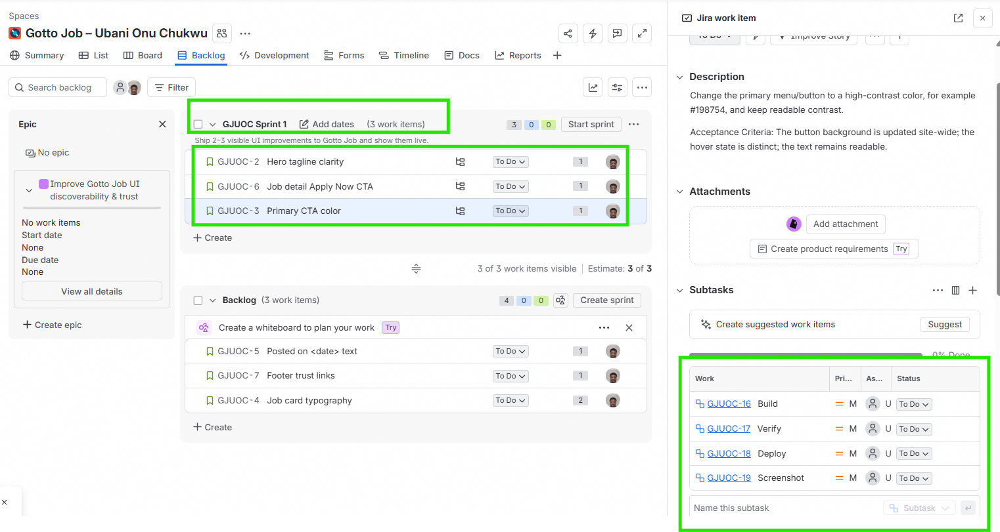

---

### Sprint 1 Scope

Stories included: Hero tagline clarity (1 pt), Job detail Apply Now CTA (1 pt), Primary CTA color (1 pt) — 3 Story Points total.

Sprint Goal: "Ship 2–3 visible UI improvements to Gotto Job and show them live."

---

# Task 7 — Reports: Open Burndown Chart

## Goal

Open the Burndown Chart and confirm it exists for Sprint 1. It is acceptable if the chart is not yet populated.

### Evidence

#### Screenshot 9 — Burndown Chart page opened, even if empty

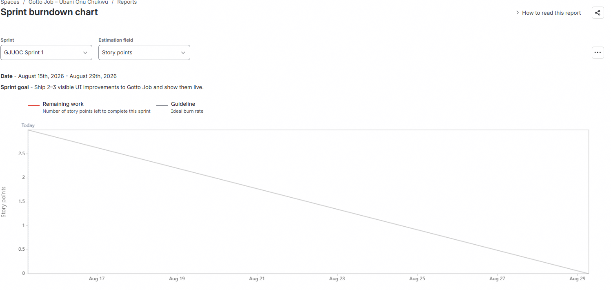

---

# Task 8 — Ship One Small Increment (Build + Deploy + Proof)

## Goal

Implement one small UI-only Story from Sprint 1, commit it, deploy it live, and move the Story and its Sub-tasks to Done in Jira.

### Evidence

#### Screenshot 10 — Jira board showing the Story moved to Done

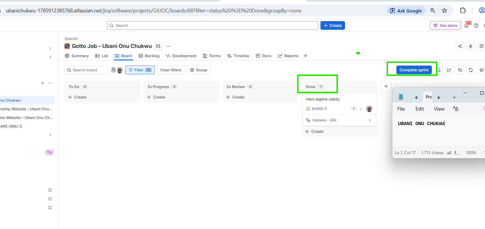

---

#### Screenshot 11 — Git commit output

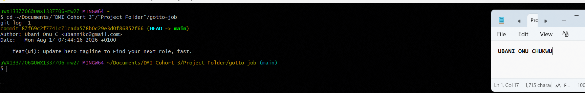

---

#### Screenshot 12 — Live URL in the browser showing the UI change, with the URL visible

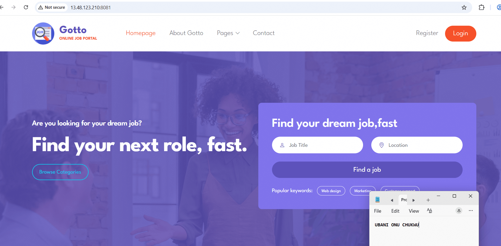

---

# Task 9 — Retro Notes (Scrum Pillar + Value)

## Goal

Add a retro comment covering what went well, what to improve, one Scrum pillar observed (Transparency, Inspection, or Adaptation), and one Scrum value (Openness, Focus, Commitment, Courage, or Respect).

### Evidence

#### Screenshot 13 — Jira retro comment visible

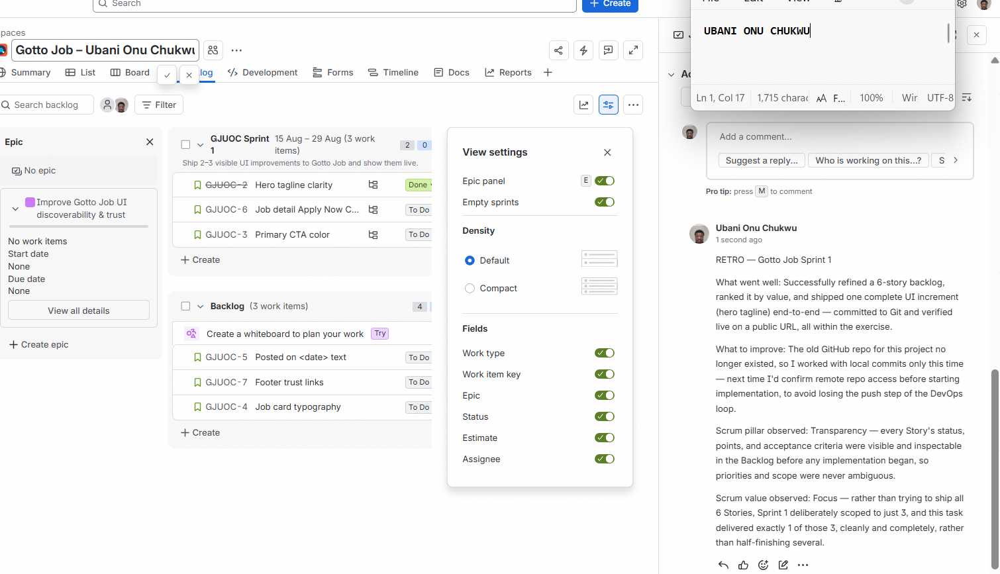

---

# Task 10 — LinkedIn Post (Mandatory)

## Goal

Publish a LinkedIn post about what you delivered, including your live URL, three to five lines on what you did and learned, and one screenshot (Burndown Chart, Sprint board, or the live UI change).

## Evidence

#### LinkedIn Post URL

https://www.linkedin.com/posts/onuchukwu-ubani-10004741_dmi-devops-micro-internship-with-agentic-share-7495227543881515008-MIjW/?utm_source=share&utm_medium=member_desktop&rcm=ACoAAAi6A9ABP5zuoQ8QP1g4mp_mBXViSDgTxy0

---

#### Screenshot 14 — Published LinkedIn post

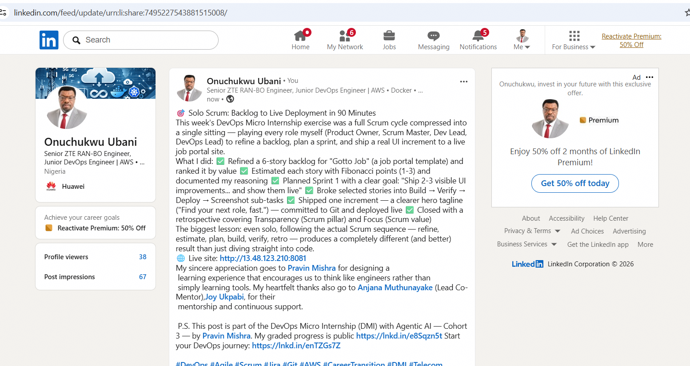

---

## Live URL

http://13.48.123.210:8081

---

# Submission Instructions

- Add all 14 required screenshots
- Full name must be visible in required screenshots
- Do not expose sensitive information (keys, passwords, account IDs)

---

# Completion Checklist

- [x] Task 1: Team Mode or Solo Mode selected and all four roles documented (Screenshot 1 & Notes)
- [x] Task 2: Team-managed Scrum project created with the required name (Screenshot 2)
- [x] Task 3: UI improvement Epic created (Screenshot 3)
- [x] Task 4: 6–8 Stories added under the Epic and ranked by value (Screenshots 4 & 5)
- [x] Task 5: Story Points set (1, 2, or 3) with reasoning recorded (Screenshot 6 & Notes)
- [x] Task 6: Sprint 1 created with Sprint Goal, 3–4 Stories, and Sub-tasks (Screenshots 7 & 8)
- [x] Task 7: Burndown Chart opened (Screenshot 9)
- [x] Task 8: One UI-only increment implemented, committed, deployed, and verified (Screenshots 10–12)
- [x] Task 9: Retro comment with one Scrum pillar and one Scrum value (Screenshot 13)
- [x] Task 10: Mandatory LinkedIn post published with the live URL, backlog refinement, Sprint planning, one shipped increment, proof, and Screenshot 14
- [x] Full Name visible in required screenshots
- [x] No sensitive data exposed

---

## 📌 About DMI & CloudAdvisory

DevOps Micro Internship (DMI) is a project-based DevOps program run by Pravin Mishra (The CloudAdvisory) focused on real-world execution, systems thinking, and career readiness.

It helps learners build strong DevOps foundations with hands-on experience.

---

## 📌 Resources

- 🌐 DMI Official Website: https://dmi.pravinmishra.com?utm_source=github&utm_medium=readme
- 🎓 University: https://university.pravinmishra.com?utm_source=github&utm_medium=readme
- 💬 Discord Community: https://discord.pravinmishra.com?utm_source=github&utm_medium=readme
- 📝 Blog: https://dmi.pravinmishra.com/blog?utm_source=github&utm_medium=readme
- ▶️ YouTube Playlist: https://www.youtube.com/playlist?list=PLFeSNDtI4Cho
- 🔗 Pravin Mishra (LinkedIn): https://www.linkedin.com/in/pravin-mishra-aws-trainer/
- 🏢 CloudAdvisory (LinkedIn): https://www.linkedin.com/company/thecloudadvisory/

---

*This submission is part of DevOps Micro Internship (DMI) Cohort 3 — Agentic AI Track.*