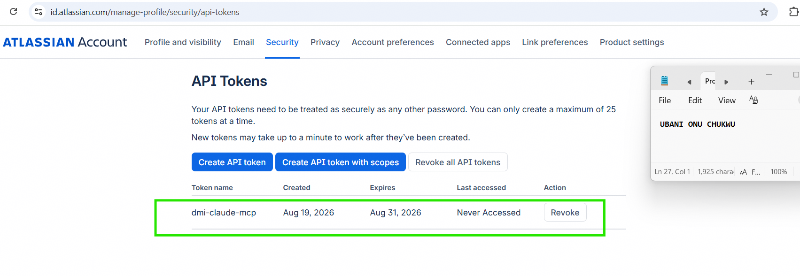
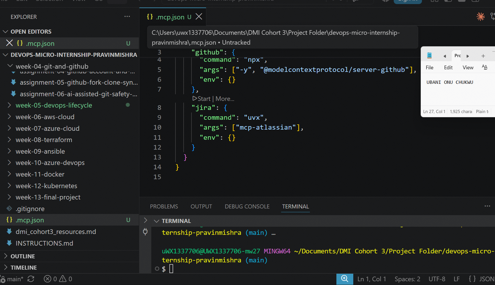
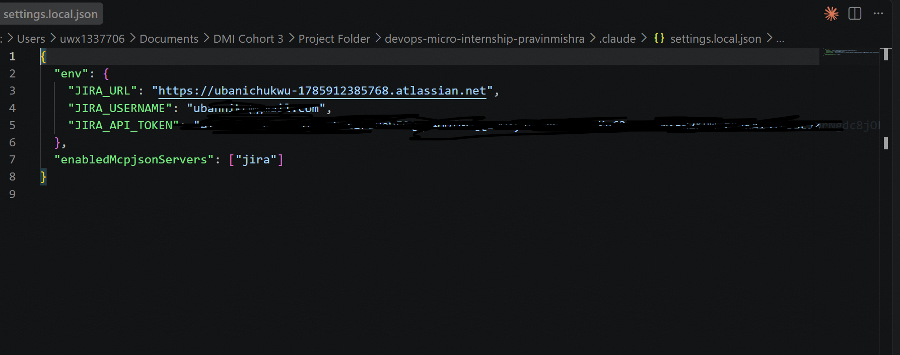
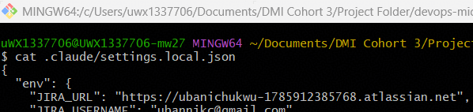
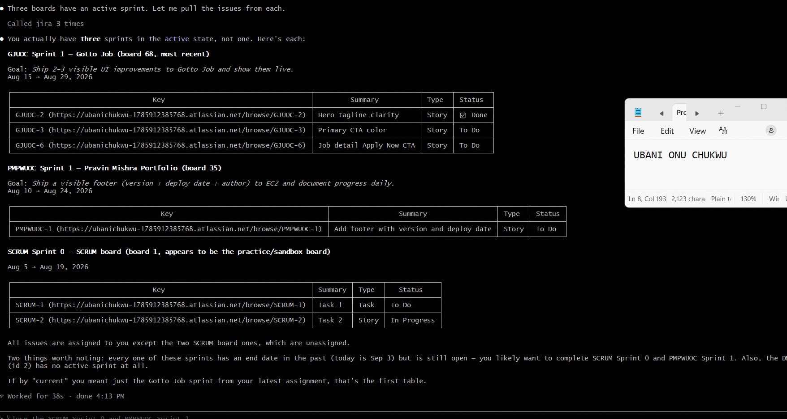
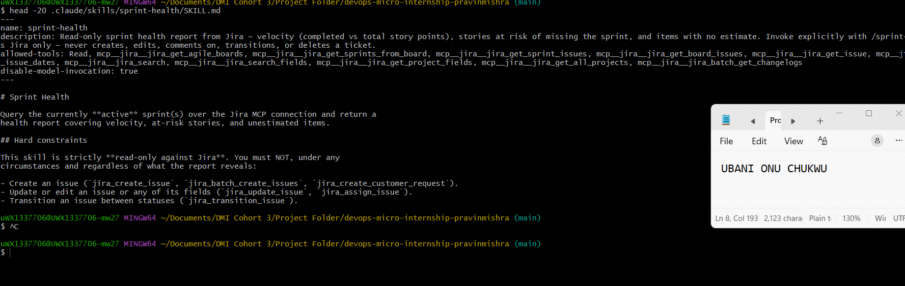
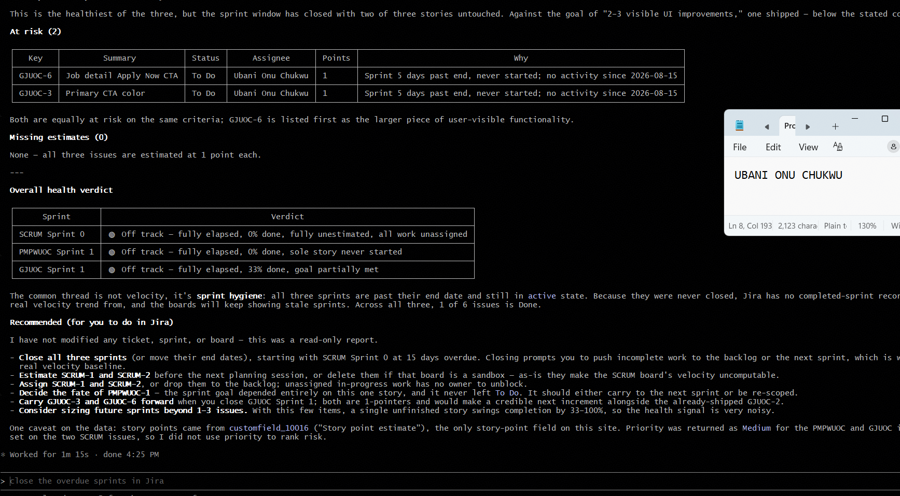

# Assignment 5 — AI-Assisted Sprint Health Report via Jira MCP

Part of the DevOps Micro Internship (DMI) Cohort 3 with Agentic AI

---

## Purpose

In this assignment, you will connect Claude Code to your Jira board through an MCP server, the same way you connected it to GitHub in Week 2, and build a read-only `/sprint-health` skill. The skill reads your current sprint through Jira's API and reports sprint velocity, stories at risk of missing the sprint, and items missing an estimate — but it must never create, edit, comment on, or transition a single ticket itself. You will prove that boundary holds by making a real change on the board yourself and confirming the skill only ever reports, never acts.

---

# Task 1 — Create a Jira API Token

## Goal

Generate an API token from your Atlassian account that the MCP server will use to authenticate with your Jira site. Do not screenshot the token value itself.

### Evidence

#### Screenshot 1 — Jira API token creation confirmation page showing the token name, with the token value not visible

### Notes You Must Write (Very Important):

**Why does the MCP server need your site URL and account email in addition to the token?**

The API token alone only proves "this request is authenticated as some valid Atlassian account" — it doesn't specify *which* Jira site to talk to (since a single Atlassian account can have access to multiple Jira Cloud sites) or *which* user identity to attribute actions to for permission checks. The site URL tells the MCP server which specific Jira instance to query, and the account email identifies which user's permissions and visible projects apply — together with the token, all three form a complete, unambiguous set of credentials, similar to how a username + password + server address are all needed together, not just a password alone.

---

# Task 2 — Create .mcp.json at the Project Root

## Goal

Create or update `.mcp.json` at your project root with a Jira MCP server block, following the same shape as the GitHub MCP server you configured in Week 2.

### Evidence

#### Screenshot 2 — `.mcp.json` open in VS Code showing the Jira server configuration

### Notes You Must Write (Very Important):

**Compare this jira block to the github block from Week 2 Assignment 5. What stays exactly the same shape despite that difference, and why doesn't Claude Code care which language a given MCP server is written in?**

Both blocks follow the identical structure: a `command` (the executable to launch the server), an `args` array (arguments passed to that command), and an `env` object (environment variables the server needs at runtime). The only difference is which package manager launches each server — `npx` runs a Node.js/JavaScript package (`@modelcontextprotocol/server-github`), while `uvx` runs a Python package (`mcp-atlassian`). Claude Code doesn't care which language the server is written in because MCP (Model Context Protocol) defines a standardized communication interface — the server exposes its tools, resources, and capabilities through the same protocol regardless of implementation language, and Claude Code simply speaks that protocol over standard input/output to whatever process the `command` launches. This is the same principle behind any client-server protocol: the client doesn't need to know what language the server is written in, only that it speaks the agreed-upon protocol correctly.

---

# Task 3 — Add Your Credentials to settings.local.json

## Goal

Add your Jira site URL, account email, and API token to `.claude/settings.local.json`, and confirm that file is listed in `.gitignore` so it is never committed.

### Evidence

#### Screenshot 3 — `settings.local.json` open in VS Code showing the `env` section, with the actual token value blurred or covered

### Notes You Must Write (Very Important):

**Why must JIRA_API_TOKEN live in settings.local.json and never in .mcp.json?**

`.mcp.json` is meant to be **tracked in Git and committed** — it defines the *shape* of the MCP server configuration (what command to run, what arguments to pass) so that anyone cloning the repo gets the same server setup. `.claude/settings.local.json`, by contrast, is explicitly excluded from Git via `.gitignore` and is meant to hold **machine-specific, secret values** — actual credentials that differ per person and must never be shared or committed. If the API token were placed in `.mcp.json` instead, it would be committed straight into Git history the moment that file is pushed, exposing a live credential to anyone with access to the public repository — exactly the kind of secret-leak scenario the pre-commit hook from Week 4 was built to catch. Keeping the *structure* (public, shareable) separate from the *secrets* (private, local-only) is the same separation-of-concerns principle used throughout DevOps: configuration vs. credentials should never live in the same file, let alone the same repository commit.

---

# Task 4 — Verify the Connection with /mcp

## Goal

Restart Claude Code and confirm the Jira MCP server shows as connected.

### Evidence

#### Screenshot 4 — `/mcp` output showing `jira: connected`

---

# Task 5 — Run a Live Query to Prove Real Board Data

## Goal

Ask Claude to list the issues in your current active sprint through the Jira MCP connection, and confirm the result matches what you see on your live board in the browser.

### Evidence

#### Screenshot 5 — Claude's response showing the live sprint issue list retrieved via Jira MCP

### Notes You Must Write (Very Important):

**How did you confirm this was real board data and not something Claude guessed?**

I cross-checked the returned issue keys directly against my browser — for example, GJUOC-2 "Hero tagline clarity" marked as ✅ Done matches exactly what I see on my live Gotto Job board (Assignment 04), where I manually moved that Story to Done. The response also included real clickable URLs (e.g., `https://ubanichukwu-1785912385768.atlassian.net/browse/GJUOC-2`) pointing to my actual Jira site, and correctly distinguished between three separate real sprints across different boards (Gotto Job, Pravin Mishra Portfolio, and the original SCRUM practice board) — details that match my actual account structure and wouldn't be something an AI could plausibly guess or hallucinate. This is the same verification principle from Week 3's Linux triage assignment: trusting AI output requires checking it against independently observable ground truth, not just accepting a plausible-sounding answer.

---

# Task 6 — Build the /sprint-health Skill

## Goal

Create a `/sprint-health` skill restricted to read-only Jira tools plus `Read`, with no issue-mutating tools and no `Write`. Run it and confirm it produces a report covering sprint velocity, at-risk stories, and items missing an estimate.

### Evidence

#### Screenshot 6 — `SKILL.md` frontmatter showing `allowed-tools` limited to read-only Jira tools plus `Read`, with `disable-model-invocation: true`

#### Screenshot 7 — `/sprint-health` output showing the full triage report against your real sprint

### Notes You Must Write (Very Important):

**1. Which Jira MCP tools does this skill's allowed-tools list include, and which mutating tools (create issue, update issue, transition issue, add comment) does it deliberately exclude?**

**Included:** `Read` plus 11 read-only Jira MCP tools — `jira_get_agile_boards`, `jira_get_sprints_from_board`, `jira_get_sprint_issues`, `jira_get_board_issues`, `jira_get_issue`, `jira_get_issue_dates`, `jira_search`, `jira_search_fields`, `jira_get_project_fields`, `jira_get_all_projects`, and `jira_batch_get_changelogs`. **Deliberately excluded:** `jira_create_issue`, `jira_batch_create_issues`, `jira_create_customer_request`, `jira_update_issue`, `jira_assign_issue`, `jira_transition_issue`, and any tool that adds comments or deletes issues — none of these appear anywhere in the `allowed-tools` list, meaning the skill is structurally incapable of calling them, regardless of what its instructions say.

**2. Why does a Scrum Master need this restriction more than almost any other role in this course?**

A Scrum Master's core responsibility is *observing and reporting* on process health — not unilaterally deciding to close sprints, reassign work, or change ticket statuses on the team's behalf. If an AI acting in this role could silently mutate the board while producing what looks like a neutral status report, it would undermine the entire premise of Scrum transparency: the team needs to trust that the data they're seeing reflects human decisions, not an AI quietly "fixing" things it judged as problems. This was demonstrated directly in this exercise — right after the report flagged three overdue sprints as "off track," I asked to close the overdue sprints, and because `/sprint-health` has no transition-capable tools, that request could not be fulfilled by the skill itself — it would require either leaving the skill's boundary entirely or, correctly, doing it myself directly in Jira.

---

# Task 7 — Prove the Skill Never Mutates the Board

## Goal

Manually update one ticket on your board in the browser (for example, move a story to "Done" or add a missing estimate), then run `/sprint-health` again and confirm the new report reflects your change — proving the skill only ever reads live state and never wrote to the board itself.

### Evidence

#### Screenshot 8 — Second `/sprint-health` run showing the report now reflects your manual board change

### Notes You Must Write (Very Important):

**Map this assignment to Gather → Analyze → Human Act → Verify from Week 3 Assignment 6. Which step did you perform manually in the browser, and why must that step stay human?**

**Gather:** The `/sprint-health` skill querying live sprint/issue data through the Jira MCP connection — real board state, not assumptions. **Analyze:** the skill's reasoning about velocity, at-risk criteria, and missing estimates, producing a structured report with a health verdict. **Human Act:** I manually added a story point estimate to SCRUM-1 directly in the Jira browser interface — this is the step that must stay human, because it's a real, state-changing decision about how much a piece of work is actually worth, which requires human judgment the skill is deliberately barred from making unilaterally (it has no `jira_update_issue` tool in its `allowed-tools` list). **Verify:** re-running `/sprint-health` afterward and confirming the report's "Missing estimates" section correctly dropped SCRUM-1, proving the skill only ever reads live state and never silently wrote the estimate itself — the exact same verification discipline used in the Linux triage assignment's "re-run the script to confirm recovery" step.

---

# Submission Instructions

Complete all tasks in sequence.

Your submission must include:
- All 8 required screenshots
- All the required notes

---

# Completion Checklist

- [x] Task 1: Jira API token created, value never screenshotted (Screenshot 1)
- [x] Task 2: `.mcp.json` has the Jira server block (Screenshot 2)
- [x] Task 3: Credentials stored in `settings.local.json`, token blurred, file gitignored (Screenshot 3)
- [x] Task 4: `/mcp` shows the Jira server connected (Screenshot 4)
- [x] Task 5: Live query returned real sprint data, verified against the browser (Screenshot 5)
- [x] Task 6: `/sprint-health` skill created with correct read-only `allowed-tools`, and produced a full report (Screenshots 6–7)
- [x] Task 7: A manual board change was reflected in a second `/sprint-health` run (Screenshot 8)
- [x] Skill never created, edited, transitioned, or commented on any issue
- [x] Reflection answered (Notes)
- [x] No API token value exposed

---

## 📌 About DMI & CloudAdvisory

DevOps Micro Internship (DMI) is a project-based DevOps program run by Pravin Mishra (The CloudAdvisory) focused on real-world execution, systems thinking, and career readiness.

It helps learners build strong DevOps foundations with hands-on experience.

---

## 📌 Resources

- 🌐 DMI Official Website: https://dmi.pravinmishra.com?utm_source=github&utm_medium=readme
- 🎓 University: https://university.pravinmishra.com?utm_source=github&utm_medium=readme
- 💬 Discord Community: https://discord.pravinmishra.com?utm_source=github&utm_medium=readme
- 📝 Blog: https://dmi.pravinmishra.com/blog?utm_source=github&utm_medium=readme
- ▶️ YouTube Playlist: https://www.youtube.com/playlist?list=PLFeSNDtI4Cho
- 🔗 Pravin Mishra (LinkedIn): https://www.linkedin.com/in/pravin-mishra-aws-trainer/
- 🏢 CloudAdvisory (LinkedIn): https://www.linkedin.com/company/thecloudadvisory/

---

*This submission is part of DevOps Micro Internship (DMI) Cohort 3 — Agentic AI Track.*