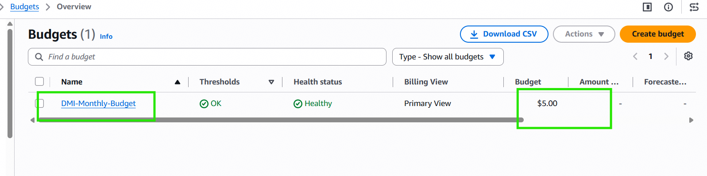

# Assignment 1 — Creating an AWS Free Tier Account & Setting Up Budget Management and Alerts
Part of the DevOps Micro Internship (DMI) Cohort 3 with Agentic AI
---
## Purpose
In this assignment, you will create your own AWS Free Tier account and configure budget management with cost alerts. This is an important first step: it lets you follow along with the rest of the course, and the alerts help ensure you do not exceed your budget.
---
# Task 1 — Sign Up for AWS and Access the Console
## Goal
Create your AWS Free Tier account, select the Basic Support Plan (Free), and log in to the AWS Management Console.
> No screenshot required for this task. Completion is verified through Task 2.
---
# Task 2 — Create a Monthly Cost Budget with Alerts
## Goal
In the Billing Dashboard, create a monthly Cost Budget with a name, amount, and start month, then configure alert thresholds (e.g. 50%, 80%, 100%) and a notification email address.
### Evidence
#### Screenshot 1 — AWS Budget setup page showing the budget name, budget amount, and alert thresholds

---
### Notes
**1. Why is it important to set up budget alerts when using an AWS account?**

Cloud costs can grow silently and unexpectedly — a forgotten running instance, an oversized resource, or a misconfigured service can rack up charges well beyond what's expected, especially once Free Tier limits are exceeded or expire after 12 months. Budget alerts act as an early warning system, notifying me before costs spiral out of control rather than discovering a large, unwelcome bill after the fact. This is especially important during a learning phase like this cohort, where I'm frequently spinning up and experimenting with new resources (EC2 instances, S3 buckets, RDS databases) — having threshold alerts at 50%, 80%, and 100% gives me multiple checkpoints to review what's actually consuming budget and shut down or resize anything unnecessary before it becomes a real financial problem.

---
# Submission Instructions
- Add the required screenshot in your submission
- Do not expose sensitive billing, card, identity, or account information
---
# Completion Checklist
- [x] AWS Free Tier account created and Basic Support Plan (Free) selected
- [x] Logged in to the AWS Management Console
- [x] Monthly Cost Budget created with name, amount, and start month
- [x] Budget alert thresholds and notification email configured
- [x] Screenshot captured showing budget name, amount, and thresholds (Screenshot 1)
- [x] Notes question answered
- [x] No sensitive billing or account information exposed
---
## 📌 About DMI & CloudAdvisory
DevOps Micro Internship (DMI) is a project-based DevOps program run by Pravin Mishra (The CloudAdvisory) focused on real-world execution, systems thinking, and career readiness.
It helps learners build strong DevOps foundations with hands-on experience.
---
## 📌 Resources
- 🌐 DMI Official Website: https://dmi.pravinmishra.com?utm_source=github&utm_medium=readme
- 🎓 University: https://university.pravinmishra.com?utm_source=github&utm_medium=readme
- 💬 Discord Community: https://discord.pravinmishra.com?utm_source=github&utm_medium=readme
- 📝 Blog: https://dmi.pravinmishra.com/blog?utm_source=github&utm_medium=readme
- ▶️ YouTube Playlist: https://www.youtube.com/playlist?list=PLFeSNDtI4Cho
- 🔗 Pravin Mishra (LinkedIn): https://www.linkedin.com/in/pravin-mishra-aws-trainer/
- 🏢 CloudAdvisory (LinkedIn): https://www.linkedin.com/company/thecloudadvisory/
---
*This submission is part of DevOps Micro Internship (DMI) Cohort 3 — Agentic AI Track.*