# Assignment 4 — Deploy EpicBook on Ubuntu VM + MySQL RDS with Secure Cloud Network

Part of the DevOps Micro Internship (DMI) Cohort 3 with Agentic AI

---

## Purpose

In this assignment, you will deploy the EpicBook web application in AWS using a secure two-tier architecture: an Ubuntu EC2 instance with Nginx in a public subnet, and a private MySQL RDS database with restricted security-group access. The completed deployment must prove that the frontend, backend, and private database communicate successfully end to end.

---

# Task 1 — Create VPC + Public/Private Subnets + Routing

## Goal

Create `epicbook-vpc` (10.0.0.0/16) with a public subnet (10.0.1.0/24) and a private subnet (10.0.2.0/24), attach an Internet Gateway, and route only the public subnet to it.

### Evidence

#### Screenshot 1 — VPC details showing CIDR 10.0.0.0/16

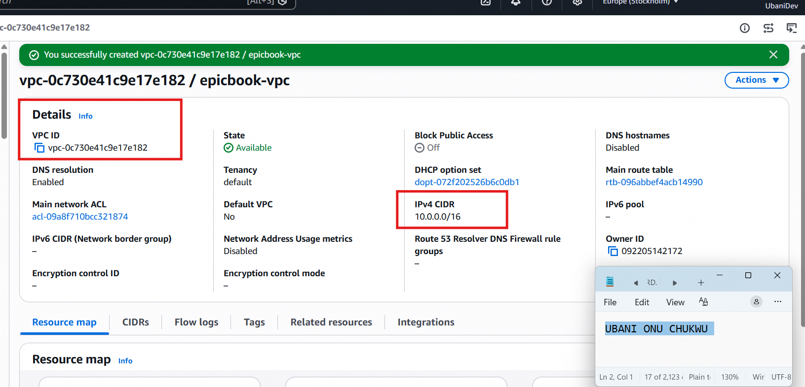

---

#### Screenshot 2 — Subnets list showing both subnets and their CIDRs

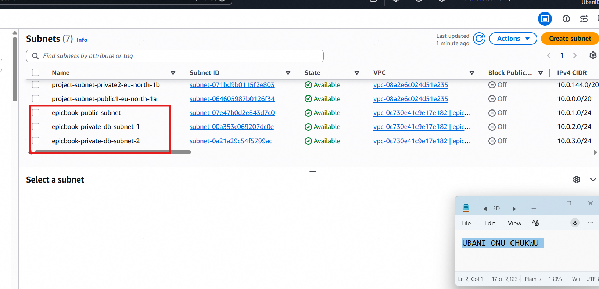

---

#### Screenshot 3 — Route table showing 0.0.0.0/0 → IGW and association with the public subnet

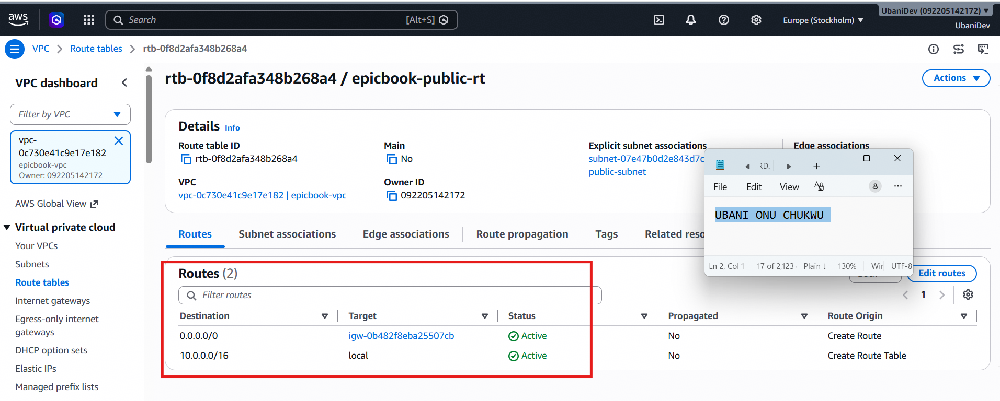

---

# Task 2 — Create Security Groups (EC2 + RDS) with Least Privilege

## Goal

Create `epicbook-ec2-sg` (SSH from your IP, HTTP/HTTPS public) and `epicbook-rds-sg` (MySQL 3306 only from `epicbook-ec2-sg`).

### Evidence

#### Screenshot 4 — EC2 security-group inbound rules showing ports and sources

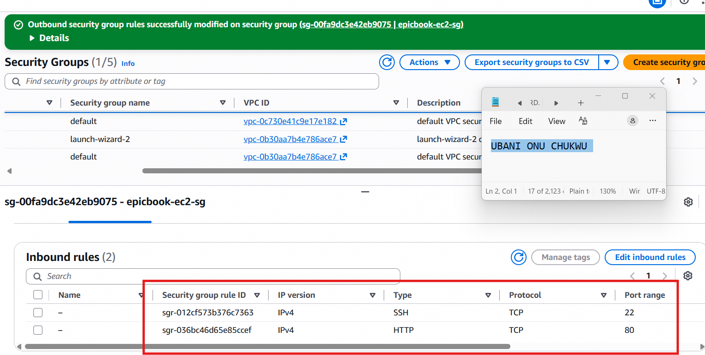

---

#### Screenshot 5 — RDS security-group inbound rule showing MySQL 3306 allowed from the EC2 security group

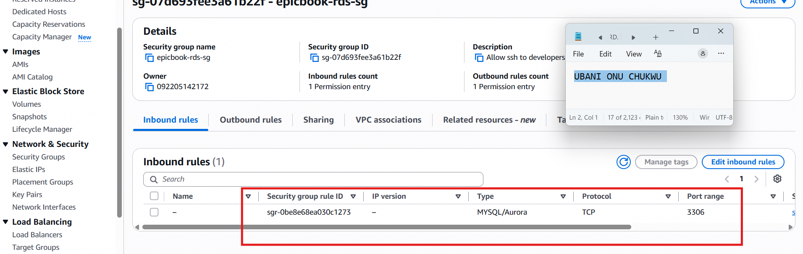

---

# Task 3 — Launch Ubuntu EC2 in Public Subnet

## Goal

Launch an Ubuntu 20.04 instance in the public subnet with `epicbook-ec2-sg` attached, and connect to it over SSH.

### Evidence

#### Screenshot 6 — EC2 instance summary showing the public IPv4 address, subnet, and security group

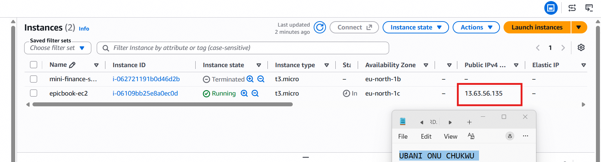

---

#### Screenshot 7 — Terminal showing a successful SSH login with the `ubuntu@...` prompt

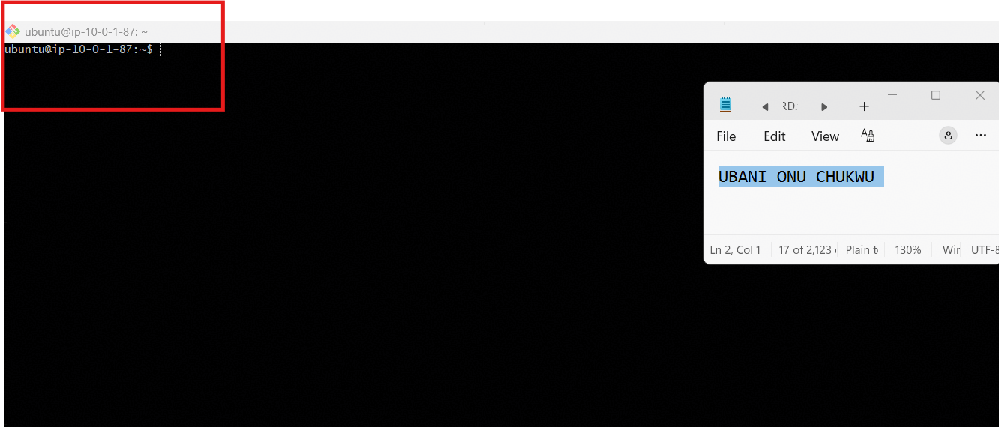

---

# Task 4 — Install Required Software on EC2

## Goal

Install Node.js, npm, Nginx, and the MySQL client on the instance, and confirm Nginx is running.

### Evidence

#### Screenshot 8 — Output of `node -v` and `npm -v`

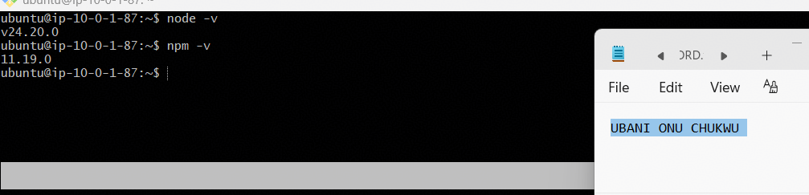

---

#### Screenshot 9 — Output of `systemctl status nginx`

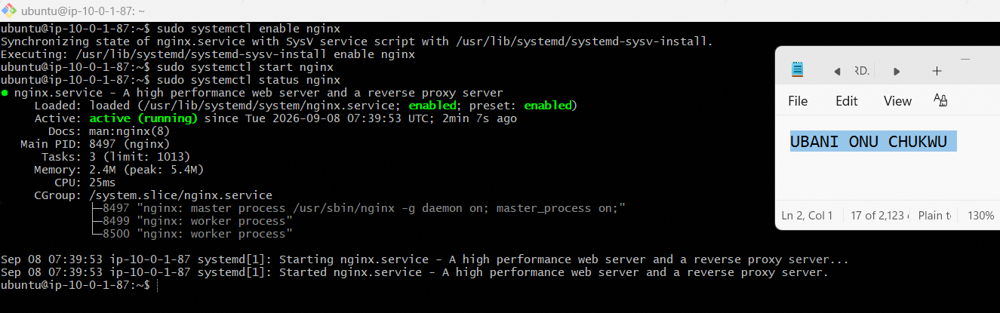

---

#### Screenshot 10 — Output of `mysql --version`

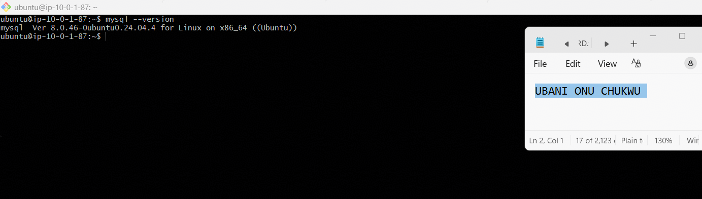

---

# Task 5 — Create RDS MySQL in Private Subnet (No Public Access)

## Goal

Create a private MySQL RDS instance in `epicbook-vpc` using a DB Subnet Group over the private subnet, with `epicbook-rds-sg` attached and public access disabled.

### Evidence

#### Screenshot 11 — RDS instance summary showing Publicly accessible: No

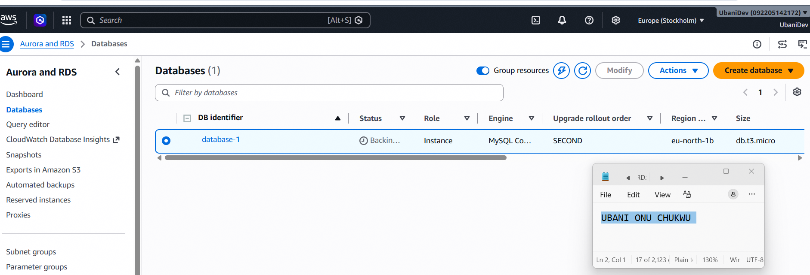

---

#### Screenshot 12 — Connectivity & security section showing the VPC and attached security group

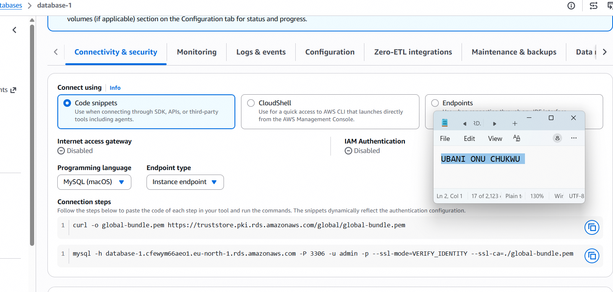

---

### Note

The RDS instance was initially configured with a Provisioned IOPS (io1) storage tier and a non-Free-Tier instance class (`db.m7g.large`) by default, producing an estimated cost of ~$962/month. This was corrected before creation by switching to Standard create, selecting only Burstable (t-class) instance types, and choosing General Purpose SSD storage — bringing the estimate down to ~$29.62/month (effectively free under the AWS Free Tier's 750 hours/month of `db.t3.micro`/`db.t4g.micro` for the first 12 months).

---

# Task 6 — Initialize Database (SQL Dump Import)

## Goal

Connect to RDS from EC2, create the `epicbook` database, and import the provided SQL dump.

### Evidence

#### Screenshot 13 — Terminal showing successful `SHOW TABLES;` output with tables listed

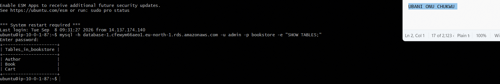

---

### Note

The repository's SQL schema and seed files hardcode the database name `bookstore` (via `USE bookstore;` and fully-qualified table references like `` `bookstore`.`Author` ``) rather than using whatever database name is passed on the command line. A database named `bookstore` was created to match the repository's expectations, and the schema (`BuyTheBook_Schema.sql`) plus seed files (`author_seed.sql`, `books_seed.sql`) were imported into it successfully.

A real connectivity issue was also diagnosed and resolved during this task: despite correct security group rules, subnet group configuration, routing, and NACLs all being verified individually, the RDS connection consistently timed out. Systematic elimination (checking the EC2 instance's actual attached security group, the RDS instance's real network interface, and finally the EC2 security group's outbound rules) revealed that `epicbook-ec2-sg` had **zero outbound rules** — meaning the instance could not send traffic anywhere, including to RDS. Adding an "allow all outbound" rule resolved the issue immediately, confirmed via a direct TCP port test before reconnecting with the MySQL client.

---

# Task 7 — Deploy EpicBook Backend and Configure Environment Variables

## Goal

Clone the EpicBook repository, install backend dependencies, configure `.env` with the RDS endpoint and credentials, and start the backend on port 3000.

### Evidence

#### Screenshot 14 — Terminal showing the repository cloned and the `ls` output

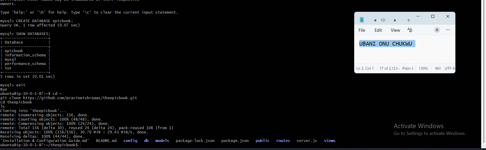

---

#### Screenshot 15 — Terminal showing the backend running, or `ss -tulpn` showing the port open

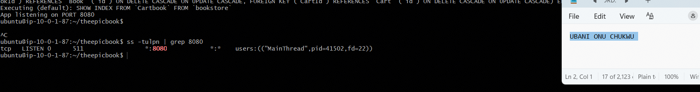

---

#### Screenshot 16 — `curl` output proving the backend responds; a 200, 301, or 404 response is acceptable if the service responds

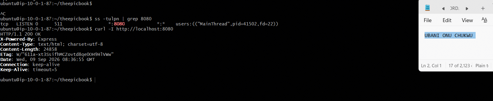

---

### Note

This repository uses a Sequelize `config/config.json` file rather than a `.env` file for database configuration, and the application listens on **port 8080** (defined in `server.js`), not port 3000. The `development` block in `config.json` was updated directly with the RDS endpoint, master username, and password, and the app was started with `NODE_ENV=development` in the background via `nohup`. Sequelize automatically synced and created the remaining application tables (`Checkout`, `Cartbook`) on first startup, confirmed in the startup log.

---

# Task 8 — Serve Frontend Using Nginx + Reverse Proxy to Backend

## Goal

Copy the frontend files to the Nginx web root and configure Nginx to reverse-proxy `/api/` to the Node backend.

### Evidence

#### Screenshot 17 — `nginx -t` success output

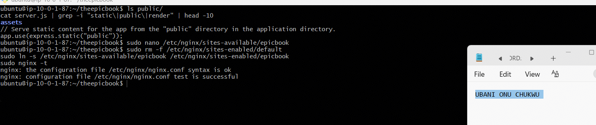

---

#### Screenshot 18 — Nginx configuration snippet showing the `/api/` reverse proxy

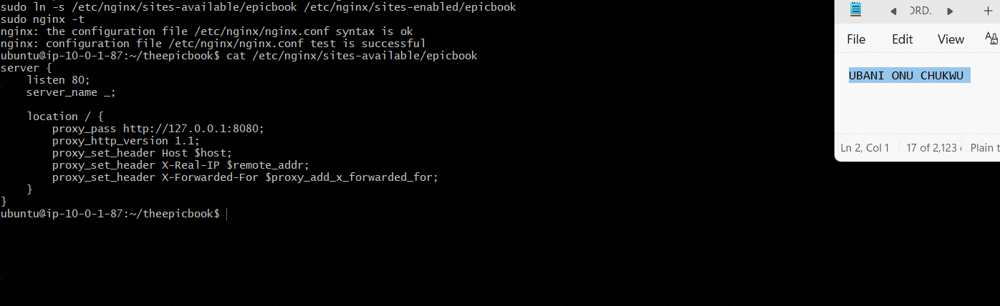

---

### Note

The EpicBook backend serves both the frontend (via Express's `express.static("public")` middleware) and any API routes from the same Node process on port 8080 — there is no separate frontend build folder to copy into `/var/www/html`. The Nginx configuration was therefore set up to reverse-proxy the entire root path (`location /`) to `http://127.0.0.1:8080`, rather than splitting `/` (static files) from `/api/` (proxy) as in a typical decoupled frontend/backend setup. A full `systemctl restart` (rather than `reload`) was required for the new site configuration to take effect after removing the default Nginx site.

---

# Task 9 — End-to-End Testing (Frontend ↔ Backend ↔ RDS)

## Goal

Verify the frontend loads publicly, the backend responds through Nginx, and EC2 can query the private RDS database.

### Evidence

#### Screenshot 19 — Browser showing the EpicBook application loaded with the public IP visible

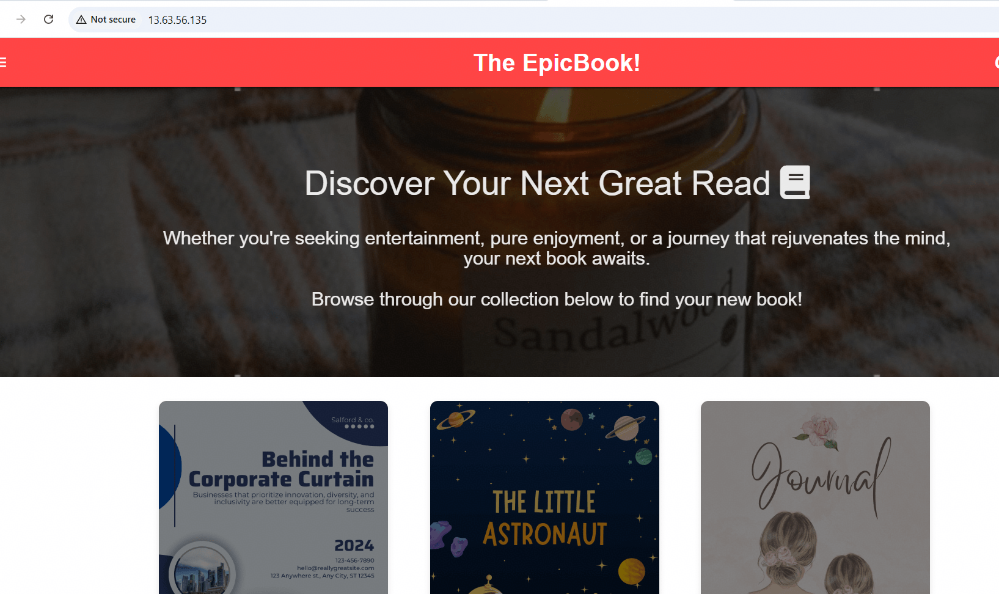

---

#### Screenshot 20 — Terminal showing a successful API call through the public endpoint, such as `curl http://<EC2_PUBLIC_IP>/api/...`

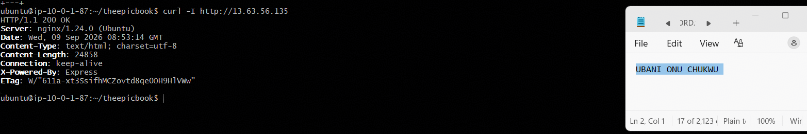

---

#### Screenshot 21 — Terminal showing the successful database connectivity test using `SELECT 1;` or similar

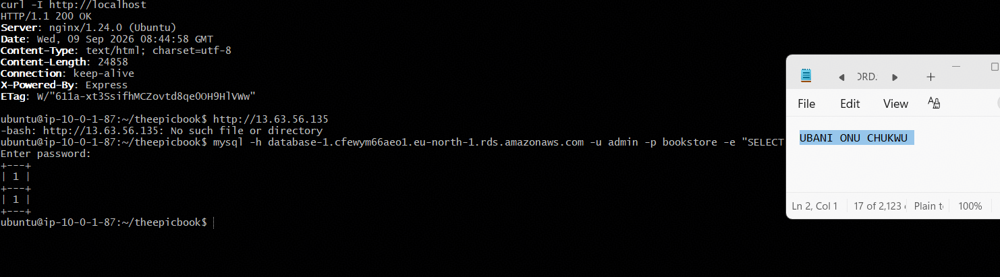

---

# Submission Instructions

- Add all required screenshots in your submission
- Do not expose PEM contents, passwords, `.env` values, or other secrets

---

# Completion Checklist

- [x] Task 1: VPC, public/private subnets, IGW, and public routing created (Screenshots 1–3)
- [x] Task 2: Least-privilege EC2 and RDS security groups created (Screenshots 4–5)
- [x] Task 3: Ubuntu EC2 launched in the public subnet with SSH verified (Screenshots 6–7)
- [x] Task 4: Node.js, npm, Nginx, and MySQL client installed (Screenshots 8–10)
- [x] Task 5: Private MySQL RDS created with no public access (Screenshots 11–12)
- [x] Task 6: Database initialized from the SQL dump (Screenshot 13)
- [x] Task 7: Backend deployed and responding on port 8080 (Screenshots 14–16)
- [x] Task 8: Nginx serving the frontend and reverse-proxying to the backend (Screenshots 17–18)
- [x] Task 9: Frontend, backend, and RDS verified end to end (Screenshots 19–21)
- [x] No sensitive data exposed

---

## 📌 About DMI & CloudAdvisory

DevOps Micro Internship (DMI) is a project-based DevOps program run by Pravin Mishra (The CloudAdvisory) focused on real-world execution, systems thinking, and career readiness.

It helps learners build strong DevOps foundations with hands-on experience.

---

## 📌 Resources

- 🌐 DMI Official Website: https://dmi.pravinmishra.com?utm_source=github&utm_medium=readme
- 🎓 University: https://university.pravinmishra.com?utm_source=github&utm_medium=readme
- 💬 Discord Community: https://discord.pravinmishra.com?utm_source=github&utm_medium=readme
- 📝 Blog: https://dmi.pravinmishra.com/blog?utm_source=github&utm_medium=readme
- ▶️ YouTube Playlist: https://www.youtube.com/playlist?list=PLFeSNDtI4Cho
- 🔗 Pravin Mishra (LinkedIn): https://www.linkedin.com/in/pravin-mishra-aws-trainer/
- 🏢 CloudAdvisory (LinkedIn): https://www.linkedin.com/company/thecloudadvisory/

---

*This submission is part of DevOps Micro Internship (DMI) Cohort 3 — Agentic AI Track.*